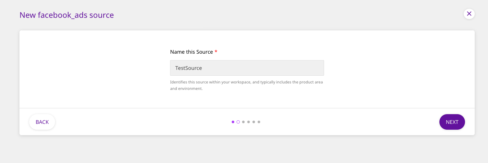
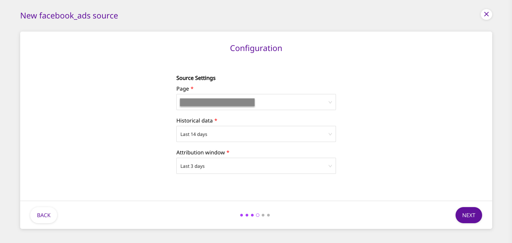
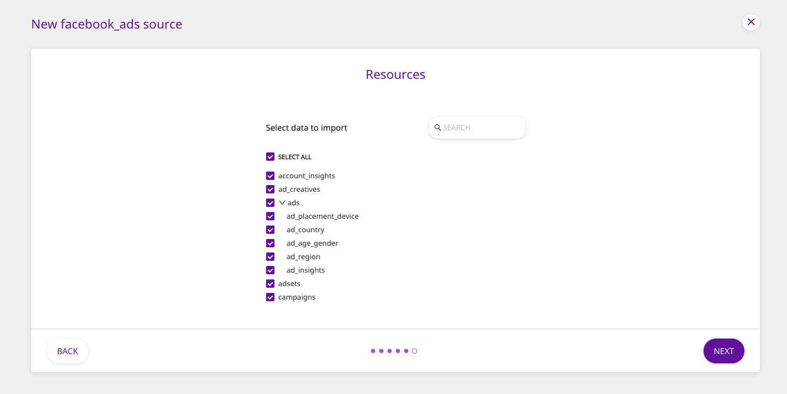

# Facebook Ads

[Facebook Ads](https://www.facebook.com/business/ads) is an online advertising platform that lets you create and run cross-device marketing campaigns, and track their performance with easy to read reports. With Facebook Ads, you can create, publish and purchase ads across all Facebook platforms - including Facebook, Instagram, Facebook Messenger, and Audience Network.

This document guides you in setting up Facebook Ads as a source in RudderStack. Once configured, RudderStack automatically ingests your specified Facebook Ads data, which can then be routed to your data warehouse or any other third-party destination supported by RudderStack.

## Getting Started

To add Facebook Ads as a source in RudderStack, follow these steps:

* Log into your [RudderStack dashboard](https://app.rudderlabs.com/signup?type=freetrial).
* From the left panel, select **Sources**. Then, click on **Add Source**, as shown:

* Next, select **Facebook Ads** from the list of **Cloud Sources**, and click on **Next**.

* Assign a name to your source, and click on **Next**.

### Setting Up the Connection

* Click on **Connect with Facebook Ads** and give RudderStack the required access permissions. Then, click on **Next**.


If you have already connected RudderStack to your Facebook Ads account, your credentials should appear automatically under **Use existing credentials**.


### Configuring the Source

* In the next screen, choose the **Page** from where you want RudderStack to import the data. Also, select the **Historical data** as well as the **Attribution window** timeframe, and click on **Next**.


RudderStack will not sync the data which is older than the selected timeframes.


### Setting the Data Update Schedule

* Next, you will be required to set the **Run Frequency** to schedule the data import from your Facebook Ads account to RudderStack. You can also specify the time when you want this synchronization to start, by choosing the time under the **Sync Starting At** option.

### Specifying the Data to Import

* Finally, select the data from the Facebook Ads page that you want RudderStack to import. You can choose to import data from select columns, or import all the data by clicking on **Select All**. Then, click on **Next**.

That's it! Facebook Ads is now successfully configured as a source on your RudderStack dashboard. 

RudderStack will start importing data from Facebook Ads as per the specified frequency. You can further connect this source to your data warehouse by clicking on **Connect Destinations** or **Add Destinations**, as shown:


Use the **Connect Destinations** option if you have already configured a data warehouse destination in RudderStack. To configure a data warehouse destination from scratch, click on the **Add Destination** button.


## What Facebook Ads Data does RudderStack Import?

| **Property** | **Table Name** | **Description** |
| :--- | :--- | :--- |
| **Account Insights** | **`account_insights`** | This table contains insights, aggregated for the whole account. Insights include Total Impressions, CPP, CPC, Reach, and CPM. |
| **Campaigns** | **`campaigns`** | This table holds information information about your campaigns. ****The columns of this table include: `name`, `objective`, `account_id`,  and`status`. |
| **AdSets** | **`adsets`** | This tables has information about your Ad Sets. The columns of this table are: `bid_amount`,`updated_time`,`campaign_id`,`daily_budget`,`lifetime_budget`, and `pacing_type`. |
| **Ads** | **`ads`** | This table contains information about your Facebook Ads. |
| **Ad Creatives** | **`ad_creatives`** | This table contains the creative content for your Facebook Ads account that you can use in your ads. |

## FAQs

#### Is it possible to have multiple Cloud Extract sources writing to the same schema?

Yes, it is. 

We have implemented a feature wherein RudderStack associates a table prefix for every Cloud Extract source writing to a warehouse schema. This way, multiple Cloud Extract sources can write to the same schema with different table prefixes.

## Contact Us

If you come across any issues while configuring Facebook Ads as a source on the RudderStack dashboard, please feel free to [contact us](mailto:%20docs@rudderstack.com). You can also start a conversation on our [Slack](https://resources.rudderstack.com/join-rudderstack-slack) channel; we will be happy to talk to you!

