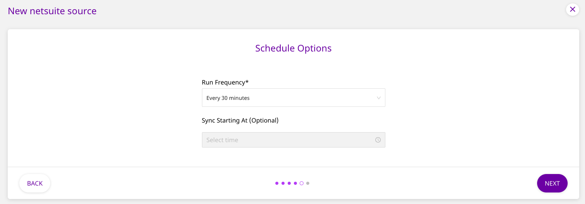
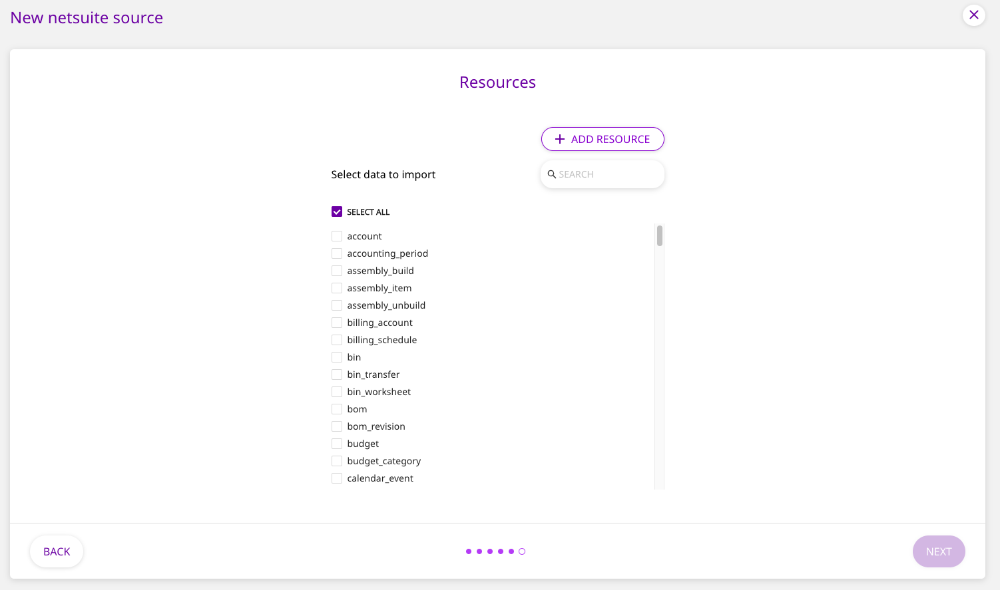
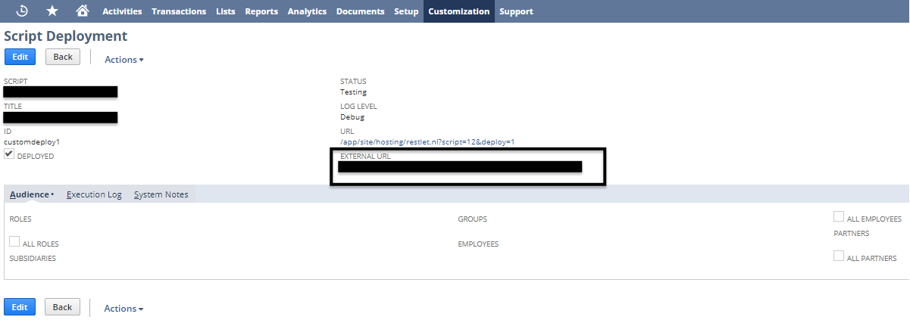

# Netsuite

[Netsuite](https://www.netsuite.com/portal/home.shtml) is a popular business management suite, delivering ERP, CRM, and eCommerce solutions to nearly 25000 customers worldwide. With NetSuite, you get a unified, real-time business management platform to manage all your ERP, automation, analytics, and marketing operations effortlessly, and at a fraction of a cost of the traditional on-premise ERP tools.

This document guides you in setting up Netsuite as a source in RudderStack. Once configured, RudderStack automatically ingests your specified Netsuite data, which can then be routed to your data warehouse or any other third-party destination supported by RudderStack.

## Getting Started

To set up Netsuite as a source on the RudderStack dashboard, follow these steps:

* Log into your [RudderStack dashboard](https://app.rudderlabs.com/signup?type=freetrial).
* From the left panel, select **Sources**. Then, click on **Add Source**, as shown:

* Next, select **Netsuite** from the list of **Cloud Sources**, and click on **Next**.

* Assign a name to your source, and click on **Next**.

### Specifying Connection Credentials

* Next, enter the relevant connection credentials required to set up your Netsuite source, as shown: 

* The connection settings are as follows: 
  * **Account Name** : Enter your Netsuite account name here. You can get it from your Netsuite dashboard
  * **Account ID** : Enter the Netsuite account ID. You can get the account ID by going to your Netsuite dashboard and navigating to **Setup** - **Integration** - **Web Services Preferences**.
  * **Consumer Key** : Your Netsuite consumer key goes here. 
  * **Consumer Secret** : Your Netsuite consumer secret goes here. 
  * **Token ID** : Enter your Netsuite token ID. 
  * **Token Secret** : Your Netsuite token secret needs to be entered here.


Refer to the **FAQs section** to know more about how to procure your Netsuite **Consumer Key**, **Consumer Secret**, **Token ID**, ****and **Token Secret**. 



If you've already configured Netsuite as a source before, you can choose the account visible under the **Use existing credentials** tab.


### Setting the Data Update Schedule

* Next, you will be required to set the **Run Frequency** to schedule the data import from your Netsuite account to RudderStack. You can also specify the time when you want this synchronization to start, by choosing the time under the **Sync Starting At** option.

### Setting the Historical Sync Date

* Set the **Historical sync start date** from when you want RudderStack all your historical Netsuite data. Also specify the **RudderStack Restlet URL**, and click **Next**.


To get the RudderStack Restlet URL, you need to first install [this script](https://js.blendo.co/netsuite/v1/restlet.js) in your Netsuite account, and paste the generated Restlet URL in the RudderStack Restlet URL field. Refer to the **FAQs section** to know more about how to add the script in your Netsuite account.


### Selecting the Data to Import

* Finally, choose the Netsuite data that you wish to ingest via RudderStack. You can either select all the data, or choose specific Intercom data attributes, as per your requirement.


Note that none of the resources are selected by default, so you will have to do the selection manually.


* RudderStack also supports two special types of resources that you can ingest from Netsuite - **custom records** and **saved searches**.  To import these resources, click on **Add Resource** on the top right, as shown above. You will see the following window:

* If you have already configured a Netsuite resource before, you can choose the **Clone from** option to use the values of that resource as is.
* Alternatively, select the appropriate **Resource type** you want to import: 
  * For a **saved\_search**, provide a **Name** for the resource, select the **Record type** that is present in your Netsuite account, and the exact **Saved search** that you have created there.
  * For a **custom\_record**, provide a **Name** for the resource, and select the custom record that is present on your Netsuite account. 
* Finally, save the information by clicking on **Save**.

That's it! Netsuite is now successfully configured as a source on your RudderStack dashboard. 

RudderStack will start ingesting data from Netsuite as per the specified frequency. You can further connect this source to your data warehouse or other third-party destinations by clicking on **Connect Destinations** or **Add Destinations**, as shown:

## FAQs

### How can I get the Netsuite Consumer Key and Consumer Secret?

To create the Netsuite Consumer Key and Consumer Secret, you will first have to add a new integration on your Netsuite account. To do so, navigate to **Setup** - **Integration** - **Manage Integrations** - **New**. Then, set up your Netsuite integration by specifying the following:

* **Name** of the integration
* Enabling the **State** option
* Checking on the Token-based **Authentication** option

Once you have entered this information, click on **Save**. Your Consumer Key and Secret should now appear on the dashboard for your use.

### How can I get the Netsuite Token ID and Token Secret?

To create a Netsuite Token ID and Token Secret, you first need to create a **Role** for RudderStack and an **Employee** that has this specific role. 

#### Step 1: Creating a Role

To create a role in Netsuite, navigate to **Setup** - **Users/Roles** - **Manage Roles** - **New**. 

Then, enter the name of the role \(e.g. RudderStack\) and select **Two-factor Authentication Required** to **Not Required**.

Then, under the **Permissions** section, go to **Setup** and assign the following permissions:

Assign **Full** permissions for the following:

* Web Services
* User Access Tokens
* Log In Using Access Tokens
* Deleted Records

Assign **View** permissions for the following:

* Custom Fields
* Custom Body Fields
* Perform Search \(you can find this under the **Lists** section next to **Setup**\)


For each pipeline resource that you want RudderStack to sync, you should give the relevant permissions for it to the Role. These resources are divided among these sections - **Transactions**, **Reports**, **Lists**, and **Custom Records**. Note that each permission should have **View** permissions.



It is extremely important that you have assigned the permissions for every resource, saved search or custom record that you want RudderStack to sync. This is required so that you don't encounter any RudderStack sync failures with permission-related issues.


#### Step 2: Creating an Employee

To create an employee, navigate to **Lists** - **Employees** - **Employees** - **New**. Then, enter the name and email ID of the employee. Under the **Access** section, select **Give Access**, and **Manually assign or change password**. Proceed to add a password. Finally, add the **Role** which you have created in the previous step. Click on **Save** to save the settings. 

#### Step 3: Create an Access Token

To create an access token, navigate to **Setup** - **User/Roles** - **Access Tokens** - **New**. Select the **Application Name**, **User**, and **Role** \(created in the steps above\). The token name will be automatically created by Netsuite.

Once you click on **Save**, the **Token ID** and **Token Secret** will appear on your screen. Please note these down somewhere safely as they will appear **this only time** - for security reasons. You can now use the Token ID and Secret to configure Netsuite as a source on the RudderStack dashboard.

### How can I get the RudderStack Restlet URL?


To get the RudderStack Restlet URL, you need to first install [this script](https://js.blendo.co/netsuite/v1/restlet.js) in your Netsuite account, and paste the generated Restlet URL in the RudderStack Restlet URL field.


To create a new **Script** in your Netsuite account, navigate to **Customization** - **Scripting** - **Scripts** - **New**. Then, click on the **+** icon to create a new script. A new window will then pop up, asking you to select the downloaded [script](https://js.blendo.co/netsuite/v1/restlet.js). Once you have attached it, click on **Save**, and then click **Create Script Record**.

Then add the **Name** of the script and the **Owner**, that is the **Employee** that you have created before \(in **Step 2** of the FAQ **How can I get the Netsuite Token ID and Token Secret?**\). Then click on **Save**.

Then, you need to deploy the script. In order to do so, click on **Deployments**, add the script **Title** and click on **Add**. After the script is deployed, click on **Save**.

Finally, click on the title of your deployed script, and you should be able to see the **External URL**, which is the **RudderStack Restlet URL** that you need to use in the Netsuite source configuration. 

## Contact Us

If you come across any issues while configuring Netsuite as a source on the RudderStack dashboard, please feel free to [contact us](mailto:%20docs@rudderstack.com). You can also start a conversation on our [Slack](https://resources.rudderstack.com/join-rudderstack-slack) channel; we will be happy to talk to you!

