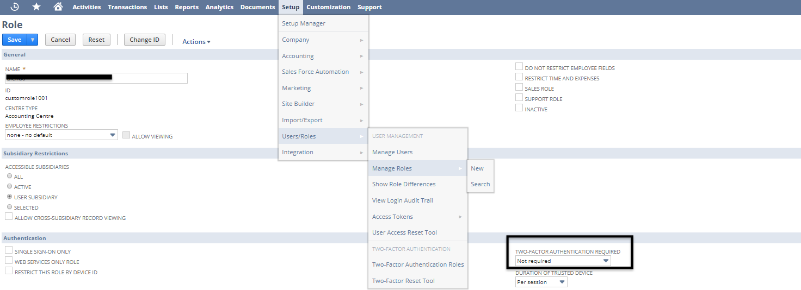
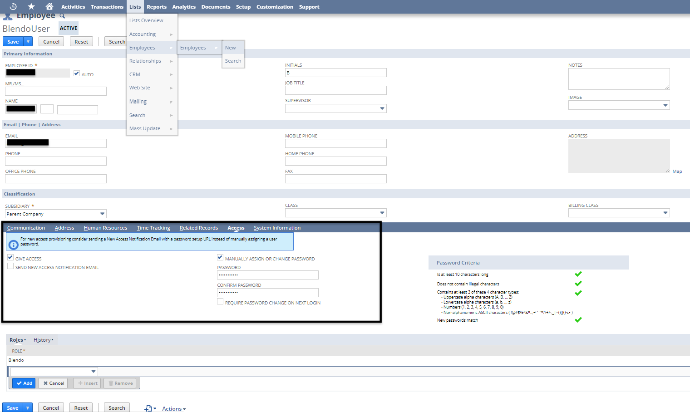
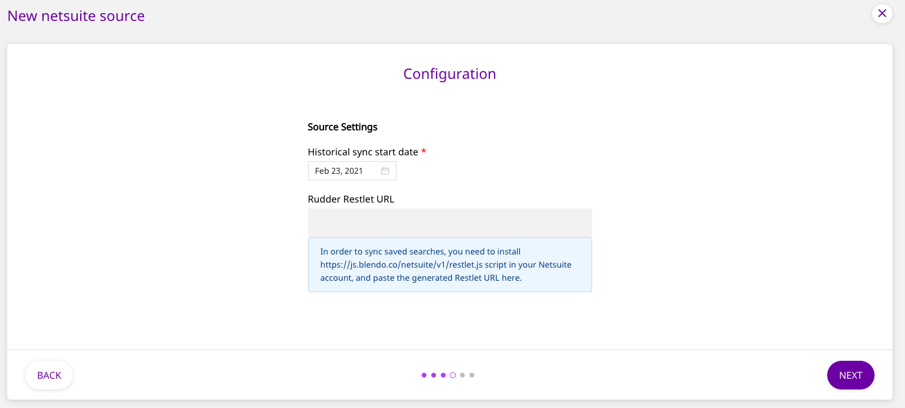
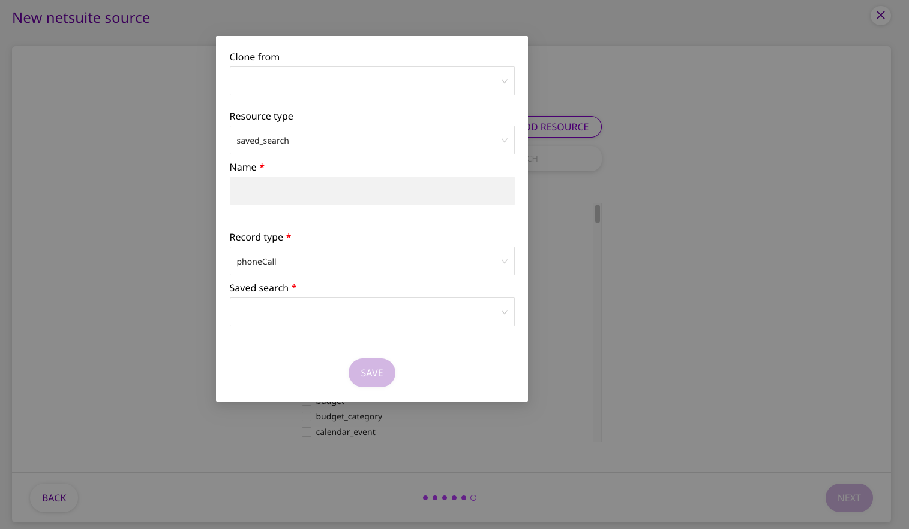

# Netsuite

[Netsuite](https://www.netsuite.com/portal/home.shtml) is a popular business management suite, delivering ERP, CRM, and eCommerce solutions to nearly 25000 customers worldwide. With NetSuite, you get a unified, real-time business management platform to manage all your ERP, automation, analytics, and marketing operations effortlessly, and at a fraction of a cost of the traditional on-premise ERP tools.

This document guides you in setting up Netsuite as a source in RudderStack. Once configured, RudderStack automatically ingests your specified Netsuite data, which can then be routed to your data warehouse destination supported by RudderStack.


**All the Cloud Extract sources support sending data only to a data warehouse destination.**


## Configuring Netsuite

### IP Whitelisting

Depending on the setup of your Netsuite organization you might have to whitelist the IPs of RudderStack. The IPs that should be whitelisted are the following:

**3.216.35.97 \| 34.198.90.241 \| 54.147.40.62 \| 23.20.96.9 \| 18.214.35.254**

To Whitelist IPs on Netsuite do the following.

1. Sign into your NetSuite account as an administrator.
2. In your NetSuite account, click **Setup &gt; Company &gt; Company** **Information**.
3. In the **Allowed IP addresses** field, add a **comma-delimited** list of the RudderStackIPs from above.
4. Click **Save**.

### Enable Token Based Authentication

Next, you’ll enable token-based authentication for your NetSuite account. This is required to generate tokens and authenticate to the SuiteTalk API.

1. On the **Enable Features** page, locate the **Manage Authentication** section. This should be after the **SuiteTalk** section.
2. Check the **Token-based Authentication** box. Your settings should look like this when finished
3. Scroll to the bottom of the page and click **Save**.

### Create an Integration

Next, you’ll create an integration record for RudderStack. This will uniquely identify RudderStack in your NetSuite account.

1. Using the global search, type `page: integrations` and click the **Page: Manage Integrations** result.
2. On the **Integrations** page, click the **New** button.
3. On the **New Integration** page, fill in the following fields: - **Name**: Enter a name for the integration. - **State**: Select **Enabled**.
4. In the **Authentication** tab, select the **Token-based Authentication** option.
5. Click the **Save** button. The confirmation page will display a **Consumer key/secret** section.
6. **Copy the Consumer Key and Secret somewhere handy.** You’ll need these credentials to complete the setup in RudderStack.

### Create a NetSuite role and configure permissions

To create a Netsuite Token ID and Token Secret, you first need to create a **Role** for RudderStack and an **Employee** that has this specific role.

#### Step 1: Creating a Role

1. Using the global search, type `page: new role` and click the **Page: New Role** result.
2. On the Role page, enter a name for the role in the **Name** field \(e.g. RudderStack\).
3. Select **Two-factor Authentication Required** to **Not Required**.

Then, under the **Permissions** section, go to **Setup** and assign the following permissions:

Assign **Full** permissions for the following:

* Web Services
* User Access Tokens
* Log In Using Access Tokens
* Deleted Records

Assign **View** permissions for the following:

* Custom Fields
* Custom Body Fields
* Perform Search \(you can find this under the **Lists** section next to **Setup**\)


For each pipeline resource that you want RudderStack to sync, you should give the relevant permissions for it to the Role. These resources are divided among these sections - **Transactions**, **Reports**, **Lists**, and **Custom Records**. Note that each permission should have **View** permissions.



It is extremely important that you have assigned the permissions for every resource, saved search or custom record that you want RudderStack to sync. This is required so that you don't encounter any RudderStack sync failures with permission-related issues.


#### Step 2: Creating an Employee

To create an employee, navigate to **Lists - Employees - Employees - New**. Then, enter the name and email ID of the employee. Under the **Access** section, select **Give Access**, and **Manually assign or change password**. Proceed to add a password. Finally, add the **Role** which you have created in the previous step. Click on **Save** to save the settings.

#### Step 3: Create an Access Token

In this step, you’ll generate access tokens for the integration record \(application\) and user role. You may need to first login as this user to properly generate the **Access Token**.

1. Using the global search, type `page: tokens` and click the **Page: Access Tokens** result.
2. Click the **New Access Token** button.
3. On the **Access Token** page, fill in the following fields: - **Application Name**: Select the integration record you created. - **User**: Select the Stitch user you created. - **Role**: Select the Stitch role you created. - **Token Name**: Enter a name for the token.
4. Click the **Save** button. The confirmation page will display a **Token ID and Secret**. Note: For security reasons, this is the only time they will be displayed.
5. **Copy the Token ID and Secret somewhere handy**. You’ll need these credentials to complete the setup.
6. You can now mark the Role as a **Web Services Only Role** by selecting the checkbox in the **Manage Roles** page. 

### Locate your NetSuite Account ID

1. Using the global search, type `page: web services` and click the **Page: Web Services Preferences** result.
2. In the Primary Information section, locate the **Account ID** field as shown in the image on the right.

**Note:** If your Account ID contains a suffix - `1234567_SB2`, for example - it should be included when entering the ID into RudderStack.

## Getting Started

To set up Netsuite as a source on the RudderStack dashboard, follow these steps:

* Log into your [RudderStack dashboard](https://app.rudderlabs.com/signup?type=freetrial).
* From the left panel, select **Sources**. Then, click on **Add Source**, as shown:

* Next, select **Netsuite** from the list of **Cloud Sources**, and click on **Next**.

* Assign a name to your source, and click on **Next**.

### Specifying Connection Credentials

* Next, enter the relevant connection credentials required to set up your Netsuite source, as shown: 

* The connection settings are as follows: 
  * **Account Name** : Enter your Netsuite account name here. You can get it from your Netsuite dashboard
  * **Account ID** : Enter the Netsuite account ID. You can get the account ID by going to your Netsuite dashboard and navigating to **Setup** - **Integration** - **Web Services Preferences**.
  * **Consumer Key** : Your Netsuite consumer key goes here. 
  * **Consumer Secret** : Your Netsuite consumer secret goes here. 
  * **Token ID** : Enter your Netsuite token ID. 
  * **Token Secret** : Your Netsuite token secret needs to be entered here.


Refer to the **FAQs section** to know more about how to procure your Netsuite **Consumer Key**, **Consumer Secret**, **Token ID**, ****and **Token Secret**. 



If you've already configured Netsuite as a source before, you can choose the account visible under the **Use existing credentials** tab.


### Setting the Data Update Schedule

* Next, you will be required to set the **Run Frequency** to schedule the data import from your Netsuite account to RudderStack. You can also specify the time when you want this synchronization to start, by choosing the time under the **Sync Starting At** option.

### Setting the Historical Sync Date

* Set the **Historical sync start date** from when you want RudderStack all your historical Netsuite data. Also specify the **RudderStack Restlet URL**, and click **Next**.


To get the RudderStack Restlet URL, you need to first install [this script](https://js.blendo.co/netsuite/v1/restlet.js) in your Netsuite account, and paste the generated Restlet URL in the RudderStack Restlet URL field. Refer to the **FAQs section** to know more about how to add the script in your Netsuite account.


### Selecting the Data to Import

* Finally, choose the Netsuite data that you wish to ingest via RudderStack. You can either select all the data, or choose specific Netsuite data attributes, as per your requirement.


Note that none of the resources are selected by default, so you will have to do the selection manually.


* RudderStack also supports two special types of resources that you can ingest from Netsuite - **custom records** and **saved searches**.  To import these resources, click on **Add Resource** on the top right, as shown above. You will see the following window:

* If you have already configured a Netsuite resource before, you can choose the **Clone from** option to use the values of that resource as is.
* Alternatively, select the appropriate **Resource type** you want to import: 
  * For a **saved\_search**, provide a **Name** for the resource, select the **Record type** that is present in your Netsuite account, and the exact **Saved search** that you have created there.
  * For a **custom\_record**, provide a **Name** for the resource, and select the custom record that is present on your Netsuite account. 
* Finally, save the information by clicking on **Save**.

That's it! Netsuite is now successfully configured as a source on your RudderStack dashboard. 

RudderStack will start ingesting data from Netsuite as per the specified frequency. You can further connect this source to your data warehouse by clicking on **Connect Destinations** or **Add Destination**, as shown:


Use the **Connect Destinations** option if you have already configured a data warehouse destination in RudderStack. To configure a data warehouse destination from scratch, click on the **Add Destination** button.


## FAQs

### How can I get the RudderStack Restlet URL?


To get the RudderStack Restlet URL, you need to first install [this script](https://js.blendo.co/netsuite/v1/restlet.js) in your Netsuite account, and paste the generated Restlet URL in the RudderStack Restlet URL field.


To create a new **Script** in your Netsuite account, navigate to **Customization** - **Scripting** - **Scripts** - **New**. Then, click on the **+** icon to create a new script. A new window will then pop up, asking you to select the downloaded [script](https://js.blendo.co/netsuite/v1/restlet.js). Once you have attached it, click on **Save**, and then click **Create Script Record**.

Then add the **Name** of the script and the **Owner**, that is the **Employee** that you have created before \(in **Step 2** of the FAQ **How can I get the Netsuite Token ID and Token Secret?**\). Then click on **Save**.

Then, you need to deploy the script. In order to do so, click on **Deployments**, add the script **Title** and click on **Add**. After the script is deployed, click on **Save**.

Finally, click on the title of your deployed script, and you should be able to see the **External URL**, which is the **RudderStack Restlet URL** that you need to use in the Netsuite source configuration. 

## FAQs

#### Is it possible to have multiple Cloud Extract sources writing to the same schema?

Yes, it is. 

We have implemented a feature wherein RudderStack associates a table prefix for every Cloud Extract source writing to a warehouse schema. This way, multiple Cloud Extract sources can write to the same schema with different table prefixes.

## Contact Us

If you come across any issues while configuring Netsuite as a source on the RudderStack dashboard, please feel free to [contact us](mailto:%20docs@rudderstack.com). You can also start a conversation on our [Slack](https://resources.rudderstack.com/join-rudderstack-slack) channel; we will be happy to talk to you!

