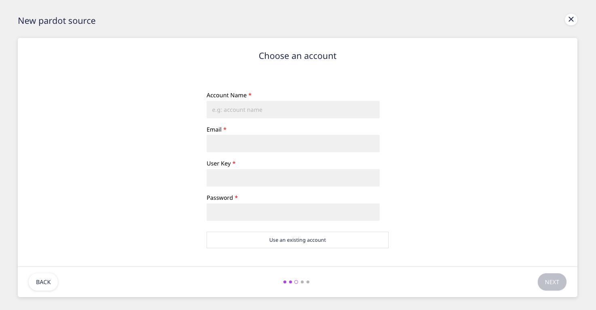

# Salesforce Pardot

[Salesforce Pardot](https://www.pardot.com) is a popular marketing automation platform. It allows businesses and marketing professionals to connect with potential customers, build meaningful relationships with them, and drive more conversion. Pardot also offers some excellent tools to empower the sales teams to close more deals.

This document guides you in setting up Pardot as a source in RudderStack. Once configured, RudderStack automatically ingests your specified Pardot data, which can then be routed to your data warehouse destination supported by RudderStack.


**All the Cloud Extract sources support sending data only to a data warehouse destination.**


## Getting Started

To add Pardot as a source in RudderStack, follow these steps:

* Log into your [RudderStack dashboard](https://app.rudderlabs.com/signup?type=freetrial).
* From the left panel, select **Directory**. Then, click on **Cloud Extract** under **Sources**, as shown below. Then, choose **Pardot** from the list of sources.

.png>)

* Assign a name to your source, and click on **Next**.

.png>)

### Setting Up the Connection

* Under **Create new account**, click on **Create Credentials from Scratch** to fill in the relevant connection credentials.

.png>)

* Enter the connection settings as shown:

* The connection settings are:\

  * **Account Name **: Your Pardot account name goes here.
  * **Email **: Enter your email ID in this field. 
  * **User Key **: Enter your Pardot user key here. More information [here](https://kb.builtwith.com/pardot/find-your-api-user-key-on-pardot/).
  * **Password **: Your Pardot password goes here.


If you have already connected RudderStack to your Pardot account, your credentials should appear automatically under **Use existing credentials**.


### Setting the Data Update Schedule

* Next, you will be required to set the **Run Frequency** to schedule the data import from your Pardot account to RudderStack. You can also specify the time when you want this synchronization to start, by choosing the time under the **Sync Starting At** option, as shown:

.png>)


You can also set a **Table Prefix** to the warehouse table where you want to send this data.


### Selecting the Data to Import

* In the next screen, choose the data you want to import from Pardot. To import all the data, click on **Select All**, as shown:

.png>)

That's it! Pardot is now successfully configured as a source on your RudderStack dashboard. 

RudderStack will start importing data from Pardot as per the specified frequency. You can further connect this source to your data warehouse by clicking on **Connect Destinations** or **Add Destination**, as shown:

.png>)


Use the **Connect Destinations** option if you have already configured a data warehouse destination in RudderStack. To configure a data warehouse destination from scratch, click on the **Add Destination** button.


## FAQs

#### Is it possible to have multiple Cloud Extract sources writing to the same schema?

Yes, it is. 

We have implemented a feature wherein RudderStack associates a table prefix for every Cloud Extract source writing to a warehouse schema. This way, multiple Cloud Extract sources can write to the same schema with different table prefixes.

## Contact Us

If you come across any issues while configuring Pardot as a source on the RudderStack dashboard, please feel free to [contact us](mailto:%20docs@rudderstack.com). You can also start a conversation on our [Slack](https://resources.rudderstack.com/join-rudderstack-slack) channel; we will be happy to talk to you!
