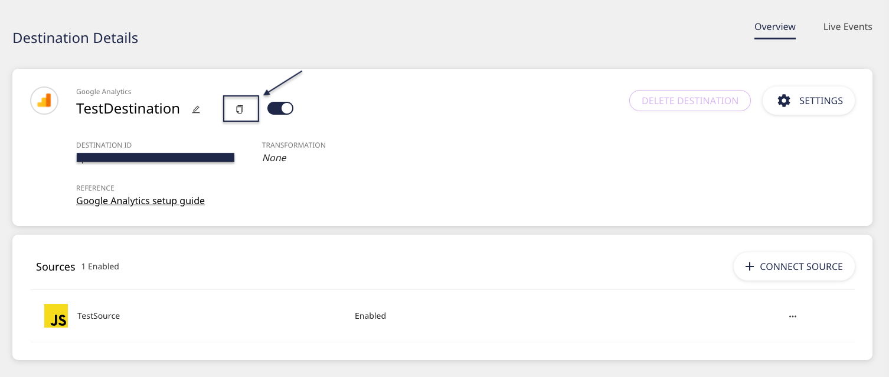
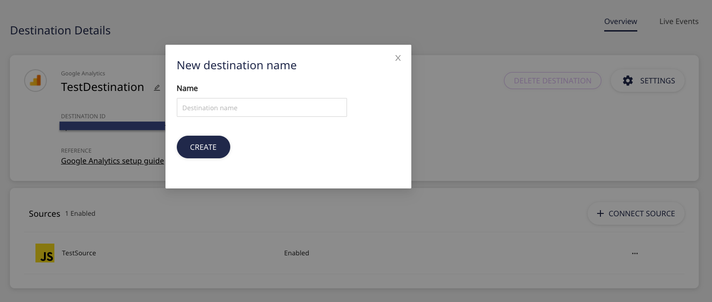
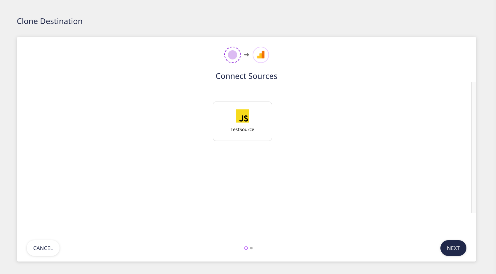
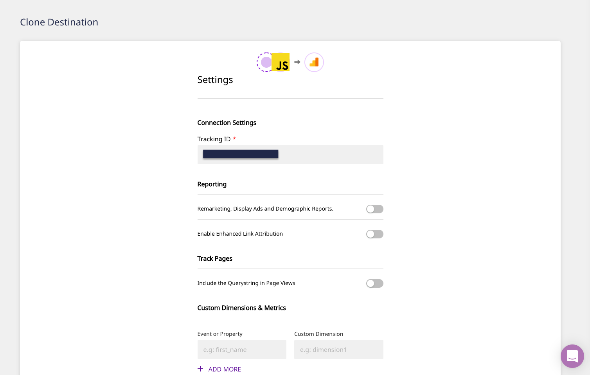

# Connections

RudderStack lets you set up connections between your preferred event data sources and destinations. With this feature, you can build efficient data pipelines across your entire customer data stack.


**With RudderStack, you can bring together all your event data across your web, mobile, server-side, and cloud apps and route this data reliably to your data warehouse and other third-party platforms of your choice.**


## Sources

A **source** refers to a platform or an application \(web, mobile, server-side, or a third-party cloud app\) from where RudderStack tracks and collects your event data.


We recommend creating a source for every unique source of data. You can also create multiple sources for each website or application from which you want to track the data.


To view all the configured sources in your RudderStack dashboard, click on **Sources** in the left navigation bar, as shown:


You can add a new source by simply clicking on the **Add Source** button. For more details on adding a source in RudderStack, refer to the guide on [**Adding a Source and Destination in RudderStack**](adding-source-and-destination-rudderstack.md).


### Source Details

To get more details on the configured source, click on it. You should then see the following view on the dashboard:

The options you see in this page are as follows:

* **Source ID**: The unique identifier associated with your source.
* **Write Key**: The write key is required to send the data from your source.


As an example, you can load [**RudderStack's JavaScript SDK**](../stream-sources/rudderstack-sdk-integration-guides/rudderstack-javascript-sdk/) on your web pages to track and collect the events by running the following:

`rudderanalytics.load(<YOUR_WRITE_KEY>, <DATA_PLANE_URL>, options);`


* **Add Destination**: You can connect your source to a new destination by clicking on this button.


If you have already configured a destination in RudderStack, you should click on the **Connect Destination** button.


* **Live Events**: Once your source and destination are successfully configured and a connection is set up and enabled, RudderStack starts tracking and collecting events from your source. These events can be viewed in real-time using this option.

### Deleting a Source

You can delete a source by clicking on the **Delete Source** button.


Before you delete a source, make sure there are no active destinations enabled for it.


## Destinations

A destination is a tool or application where you want to send the data via RudderStack.


RudderStack currently supports over 80 destinations. These include [**data warehouses**](https://docs.rudderstack.com/data-warehouse-integrations), [**analytics**](https://docs.rudderstack.com/destinations/analytics) platforms, [**CRMs**](https://docs.rudderstack.com/destinations/crm), [**marketing**](https://docs.rudderstack.com/destinations/marketing) platforms, and more.

Check out the [**Destinations**](../destinations/) guide for the complete list of supported destinations.


To view all the configured destinations in your RudderStack dashboard, click on **Destinations** in the left navigation bar, as shown:


You can add a new destination by clicking on the **Add Destination** button. For more details on adding a source in RudderStack, refer to the guide on [**Adding a Source and Destination in RudderStack**](https://docs.rudderstack.com/getting-started/adding-source-and-destination-rudderstack).


### Destination Details

To get more details on the configured destination, click on it. You should then see the **Destination Details** page on your dashboard:

You will see the following options:

* **Destination ID**: The unique identifier associated with your destination.
* **Transformation**: RudderStack allows you to transform your events before routing them across to your destination.


Read more about RudderStack's [**Transformations**](../transformations/) feature.


* **Settings**: You can change the settings of your configured destination by clicking on this button.
* **Connect Source**: If you haven't added a source while configuring your destination, you can do so by clicking on this button.
* **Live Events**: RudderStack allows you to view the events delivered to the destination in real-time. Click on this option to view the live events.

### Cloning a Destination

With this option, you can clone an existing destination with the same or new configuration settings.

Follow these steps to clone a destination:

* On the **Destination Details** page, click on the **Clone To a New Destination** option as shown:

  

* Assign a name to the new destination and click on **Create**.

  

* Connect this destination to a source, as shown:

  

* Enter the **Connection Settings** for this new destination, and click on **Next**.

  

* Your new destination should now be configured.

  

### Deleting a Destination

You can delete a destination by clicking on the **Delete Destination** button.


Before you delete a destination, make sure there are no active sources enabled for it.


## Setting Up a Connection

Setting up a connection in RudderStack involves configuring and connecting your data sources and destinations in the RudderStack dashboard.

Refer to the following guide for step-by-step instructions on how to set up a connection from scratch:



Once you've set up a connection, you should be able to view it in your RudderStack dashboard by clicking on the **Connections** tab on the left navigation bar, as shown:

You can also send your data from one source to multiple destinations, as shown:

## Contact Us

To know more about connections in RudderStack, feel free to [**contact us**](mailto:%20docs@rudderstack.com) or start a conversation on our [**Slack**](https://resources.rudderstack.com/join-rudderstack-slack) channel. You can also see this feature in action by [**requesting a demo**](https://resources.rudderstack.com/request-a-demo?_ga=2.47794151.1545771517.1607313913-1655106949.1598281099).

