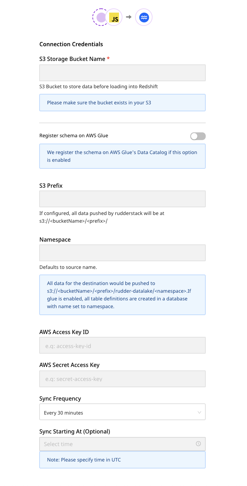
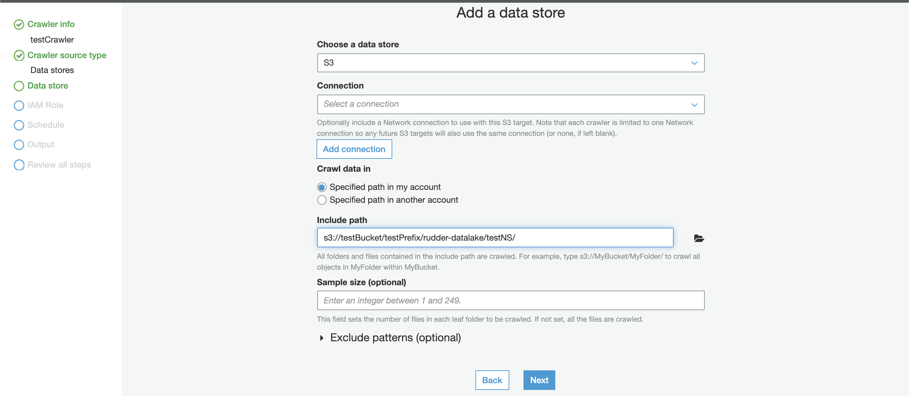
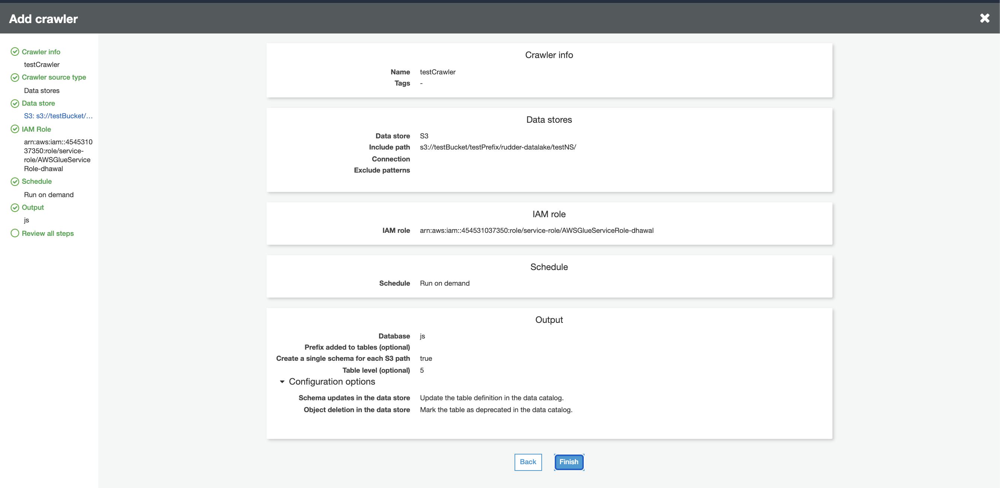

# Amazon S3 Data Lake

Amazon S3 is a popular object storage service used to store both structured and unstructured data. You can leverage S3 to securely and cost-effectively build a data lake of any size or scale. With an S3-powered data lake, you can easily use the native AWS services for data processing, analytics, machine learning, and more.

RudderStack supports S3 data lake as a destination to which you can securely send your data.

## Setting Up the S3 Data Lake Destination

To start sending data to your S3 data lake, you will first need to add it as a destination in RudderStack and connect it to a data source. Once the destination is enabled, the events will automatically start flowing to your data lake.

Follow these steps to configure S3 data lake as a destination in RudderStack:

* From your [**RudderStack dashboard**](https://app.rudderstack.com), configure the data source. Then, from the list of destinations, select **S3 Data Lake**.


Refer to the [**Adding a Source and Destination in RudderStack**](https://docs.rudderstack.com/connections/adding-source-and-destination-rudderstack) guide for more information.


* Assign a name to your destination and click on **Next**. You should then see the following screen:

### Connection Settings

Add the following credentials in the **Connection Settings**:

* **Staging S3 Storage Bucket Name**: Enter the name of the S3 bucket that will be used to store data before loading it into the S3 data lake.\

* **Register schema on AWS Glue**: If you enable this option, RudderStack will register the schema of your incoming data on AWS Glue's data catalog.


For more information on registering your schema in AWS Glue, refer to the AWS Glue [**documentation**](https://docs.aws.amazon.com/glue/latest/dg/schema-registry.html).


* **AWS Glue Region**: Specify your AWS Glue region. For example, for N.Virginia, it would be **`us-east-1`**.\

* **S3 Prefix**: If specified, RudderStack will create a folder in the bucket with this prefix and push all the data within that folder.\

* **Namespace**: If specified, all the data for the destination will be pushed to `s3://<bucketName>/<prefix>/rudder-datalake/<namespace>`. If AWS Glue is enabled, all the table definitions are created in a database with the name set to this namespace.


If you don't specify a namespace in the settings, it is set to the source name by default.


* **AWS Access Key ID**: Enter your AWS access key ID.\

* **AWS Secret Access Key**: Enter your AWS secret access key.


Make sure the above credentials (**Access Key ID** and **Secret Access Key**) should have permissions to read and write into the configured bucket.



 If AWS Glue is enabled, make sure to grant the following permissions:

* glue:CreateTable
* glue:UpdateTable
* glue:CreateDatabase
* glue:GetTables


### Finding Your Data in the S3 Data Lake

RudderStack converts your events into Parquet files and dumps them to the configured S3 bucket. Before dumping the events, RudderStack groups them by the event name based on the time (UTC) they were received. The folder structure looks something like the following:

`s3://<bucketName>/<prefix>/rudder-datalake/<namespace>/<tableName>/YYYY/MM/DD/HH`

As mentioned in the **Connection Settings** section above:

* **`prefix`**: This is the S3 prefix in the destination settings. If not specified, RudderStack will omit this value.\

* **`namespace`**: The namespace specified in the destination settings. If not specified, it defaults to the source name.\

* **`tableName`**: This is set to the event name.

**`YYYY`**, **`MM`**, **`DD`**, and **`HH`** are replaced by actual time values. A combination of these values represents the UTC time.

Suppose that RudderStack tracks the following two events:

| **Event Name**      | **Timestamp**                   |
| ------------------- | ------------------------------- |
| `Product Purchased` | `"2019-10-12T08:40:50.52Z" UTC` |
| `Cart Viewed`       | `"2019-11-12T09:34:50.52Z" UTC` |

RudderStack will convert these events into Parquet files and dump them into the following folders:

| **Event Name**      | **Folder Location**                                                                      |
| ------------------- | ---------------------------------------------------------------------------------------- |
| `Product Purchased` | `s3://<bucketName>/<prefix>/rudder-datalake/<namespace>/product_purchased/2019/10/12/08` |
| `Cart Viewed`       | `s3://<bucketName>/<prefix>/rudder-datalake/<namespace>/cart_viewed/2019/11/12/09`       |


If AWS Glue is enabled, all the table definitions are created in a database with the name set to the namespace (as specified in the destination settings).


## Creating a Crawler


Refer to this section **only** if you haven't enabled the **Register Schema on AWS Glue** setting while configuring the S3 data lake destination in RudderStack.


In the absence of AWS Glue, you can create a crawler to go through your data and create table definitions out of it. Follow these steps to create a crawler:

* Go to your AWS Glue console and select **Crawler** from the left pane.\

* Select **Add Crawler**.\

* Specify a name for your crawler and click **Next**, as shown:

* Next, under the **Crawler source type** section, choose **Data stores**.

* Configure the **Repeat crawls of S3 data stores** based on your requirement.\

* Then, under the **Data store** section, select **S3** from the dropdown for the **Choose a data store** setting, as shown:

* For the **Crawl data in** setting, choose the option **Specified path in my account**.\

* In the **Include path** setting, enter the S3 URI of your configured bucket followed by the suffix `/<prefix>/rudder-datalake/<namespace>/`.


For example, if your S3 bucket name is `testBucket` and the configured prefix and namespace are `testPrefix` and `testNameSpace` respectively, then your path should be:

`s3://testBucket/testPrefix/rudder-datalake/testNameSpace/`



If you have not configured any prefix while setting up the S3 data lake destination in RudderStack, omit the prefix. Your URI would then be:

`s3://testBucket/rudder-datalake/testNameSpace/`.


* Then, under the **Add another data store** setting, select **No**.

* In the **IAM Role** section, configure a suitable IAM role.

* Next, In the **Schedule** section, select the frequency of your crawler from the dropdown options, as shown:

* In the **Output** section, configure the database that will store all the tables. Under the Grouping behavior for S3 data section, make sure you enable (tick) the **Create a single schema for each S3 path** option, as shown:

* Specify the **Table level** as **5** or **4** (refer to the tips below). This value indicates the absolute level of the table location in the bucket.


The level for the top-level folder is **1**. For example, for the path `mydataset/a/b`, if the level is set to 3, the table will be created at the location `mydataset/a/b`. Similarly, if the level is set to 2, the table will be created at the location `mydataset/a`.



Since all tables are created in the URI `s3://testBucket/<prefix>/rudder-datalake/<namespace>/`, make sure the table level should be set to:

* **5** if a prefix is configured
* **4** if a prefix is **not** configured


* Review your crawler configuration, as shown:

* Click on **Finish** to confirm the configuration.\

* Then, click on your crawler and run it. Wait for the process to finish - you should see some tables getting created in your configured database.

## Querying Data using AWS Athena

You can query your S3 data using a tool like [**AWS Athena**](https://aws.amazon.com/athena/), which lets you run SQL queries on S3.


Before querying your data on S3, make sure that you have sent some data to S3, and that the sync has been completed.


Follow these steps to start querying your data on s3 -

* Open your AWS Athena console. Then, go to the same AWS region which you used while configuring AWS Glue.\

* In the left pane, select `AwsDataCatalog` as your data source, as shown:

* Select your configured namespace (or the database you specified while configuring the crawler) from the database dropdown menu.


By default, the namespace is set to your source name if you did not specify it in the destination settings.


* You should see some tables already created under the **Tables** section in the left pane.\

* You can preview the data by clicking on the three dots next to the table and selecting the **Preview Data** option. Alternatively, you can run your own SQL queries in the workspace on the right, as shown:

## Contact Us

If you come across any issues while setting up using the S3 data lake destination, you can [**contact us**](mailto:%20docs@rudderstack.com) or start a conversation on our [**Slack**](https://resources.rudderstack.com/join-rudderstack-slack) channel.
