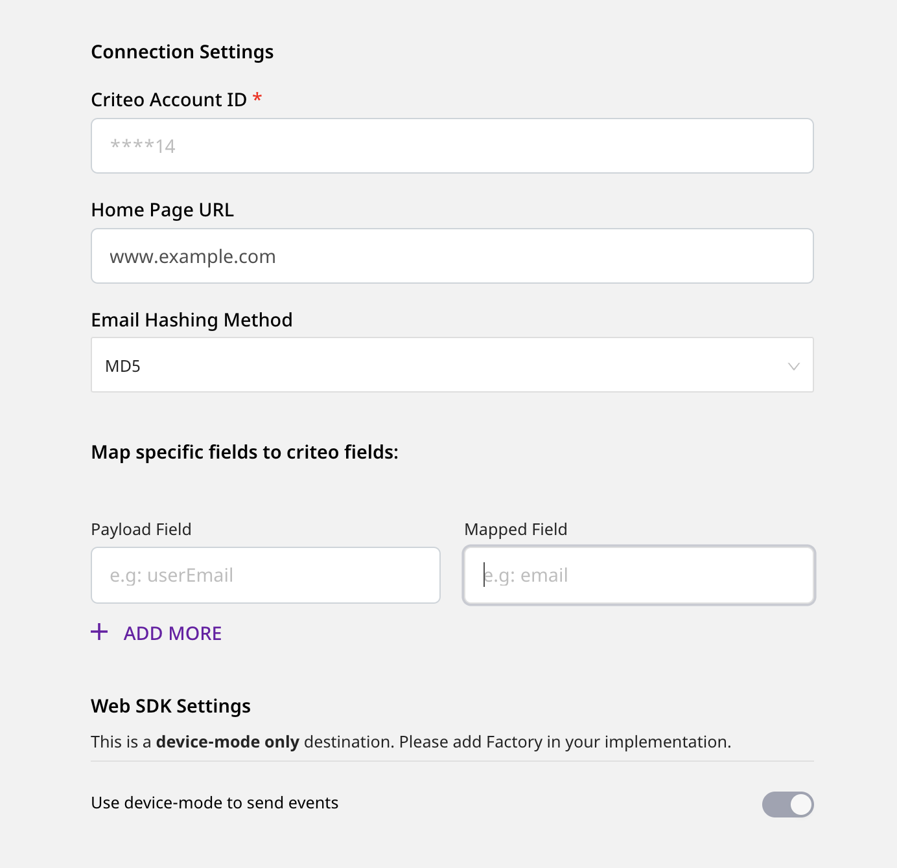

# Criteo

[**Criteo**](https://www.criteo.com/) is a popular online display advertising platform that offers various solutions to increase your website traffic. It also helps you generate brand awareness and boost sales, conversions, and app installs.

RudderStack supports Criteo as a destination to which you can send your event data directly.

## Getting Started

Before configuring Criteo as a destination in RudderStack, verify if Criteo supports the source platform you are sending the events from. Refer to the following table:

| **Connection Mode** | **Web** | **Mobile** | **Server** |
| :--- | :--- | :--- | :--- |
| **Device mode** | **Supported** | - | - |
| **Cloud mode** | - | - | - |


To know more about the difference between Cloud mode and Device mode in RudderStack, read the [**RudderStack connection modes**](https://docs.rudderstack.com/get-started/rudderstack-connection-modes) guide.


Once you have confirmed that the source platform supports sending events to Criteo, follow these steps:

* From your [**RudderStack dashboard**](https://app.rudderstack.com/), add the source and select **Criteo** from the list of destinations.


Follow our guide on [**How to Add a Source and Destination in RudderStack**](https://docs.rudderstack.com/how-to-guides/adding-source-and-destination-rudderstack) for more information.




### Configuration Settings

To successfully configure Criteo as a destination, you will need to configure the following settings:

* **Criteo Account ID:** Enter your Criteo Account ID or Partner ID here.


Refer to the **FAQ** section below for more information on getting your Account/Partner ID.


* **Home Page URL:** Enter the complete URL of your website’s homepage. This is useful when the **homepage tag** needs to be fired to add visitors to your target audience.


This field is required when you need to fire the homepage tag in cases where the event name of the `page` call is anything other than `home`.


* **Email Hashing Method:** Criteo lets you use the email addresses in both hashed and non-hashed formats. If **MD5** is chosen as an option, RudderStack will hash-encode the email address.
* **Map Specific Fields to Criteo Fields:** Enter the payload fields and the corresponding mapped fields that will be used to send the event data to Criteo.

## Page

The `page` call lets you track the user's home page along with its associated properties.


Use this call only to track the home page and add the users to your target audience.


The home page tag will be fired in the following three scenarios:

* When the name of the `page` call is `home`.
* When the current URL of the web page is same as the **Home Page URL** specified in the RudderStack dashboard. 
* When the URL mentioned in the `properties` of the `page` call is same as the **Home Page URL** specified in the RudderStack dashboard. 


The home page tag will **not** be fired in any other scenario.


A sample `page` call is as shown below:

```javascript
window.rudderanalytics.page("category", "home", {
        path: "path",
        url: "url",
        title: "title",
        search: "search",
        referrer: "referrer",
        testDimension: "true"
});
```

## Track

The `track` call lets you capture any user action and the properties associated with it. Each action is considered to be an event.

A sample `track` call is as shown:

```javascript
   rudderanalytics.track('Product Viewed', {
            product_id: 'Prod12345',
            quantity: 1,
            price: 19.99,
            name: 'my product',
            category: 'categ 1',
            sku: 'p-666',
            list: 'Gallery',
            testDimension: true,
            testMetric: true
          });
```

In this snippet, RudderStack captures the information related to the `Product Viewed` event and the associated details such as quantity, price, category, etc.

The following table details the mapping of the [**Rudderstack E-Commerce events**](https://docs.rudderstack.com/rudderstack-api/rudderstack-ecommerce-events-specification) and the [**Criteo OneTag events**](https://support.criteo.com/s/article?article=All-Criteo-OneTag-events-and-parameters&language=en_US).

| **Rudderstack E-Commerce Event** | **Criteo OneTag Event** | **OneTag Event Name Used By Criteo** |
| :--- | :--- | :--- |
| `Product Viewed` | `Product tag` | `viewItem` |
| `Cart Viewed` | `Basket/cart tag` | `viewBasket` |
| `Order Completed` | `Sales Tag` | `trackTransaction` |
| `Product List Viewed` | `Category/keyword search/listing tag` | `viewList` |


If the `Category/keyword search/listing tag` needs to be fired with the filters, enter it within the `filters` field of the `properties` inside the `Product List Viewed` tag.


The `filters` field is an array of objects that consists of each filter category in every single object. Criteo expects `name`, `operator,` and `value` fields for every filter that needs to be passed to Criteo.

For example, a simple `Product List Viewed` event that fires a `Category/keyword search/listing Tag` is as shown:

```javascript
 rudderanalytics.track(
          'Product List Viewed', {
          email: 'name@domain.com',
          zipCode: '12345',
          category: 'abc',
          keywords: 'key',
          page_number: 1,
          filters : [
              {
             name: 'processor',
             operator: 'eq',
             value:'snapdragon',
              }
          ],
          products: [
            {
              product_id: '223344ffdds3ff3'
            },
            {
              product_id: '343344ff5567ff3'
            }
          ]
        }
        );
```

## FAQ

### How do I get my Account/Partner ID?

To get your Criteo account/partner ID, follow these steps:

* Log into your [**Criteo account**](https://www.criteo.com/login/).
* In the left navigation bar, go to **Event Tracking** under **Assets**, as shown:


* Click on **Setup**, followed by **Direct Implementation**.
* In the resulting loader file, you can find your 5-digit partner ID in the `src` key, as shown:


## Contact Us

If you come across any issues while configuring Criteo with RudderStack, feel free to [**contact us**](mailto:docs@rudderstack.com) or start a conversation on our [**Slack**](https://resources.rudderstack.com/join-rudderstack-slack) channel.

