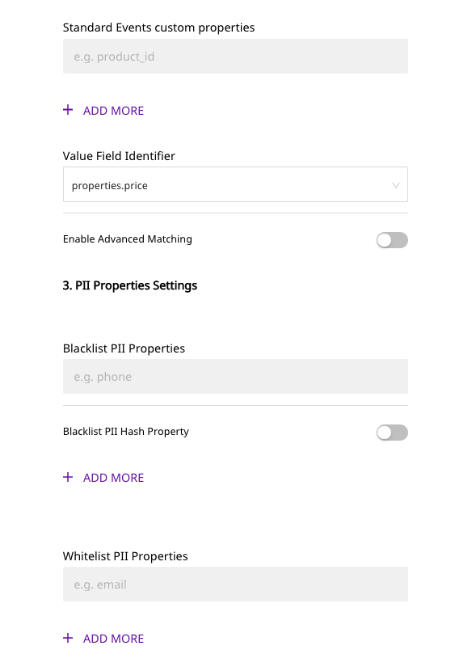
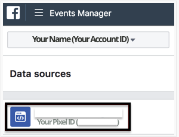
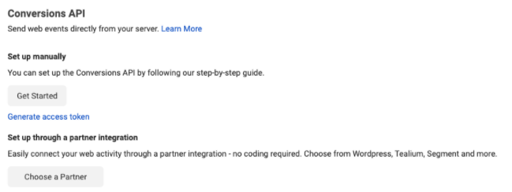

# Facebook Pixel

[Facebook Pixel](https://developers.facebook.com/docs/facebook-pixel/) is a simple JavaScript snippet that you can add to your website and track visitor activity as well as other important metrics. It allows you to measure and rudder audiences to build effective marketing and advertising campaigns.

You can now send your event data directly to Facebook Pixel through RudderStack.


**Find the open-source transformer code for this destination in our** [**GitHub repo**](https://github.com/rudderlabs/rudder-transformer/tree/master/v0/destinations/facebook_pixel)**.**


## Getting Started

To enable sending your event data to Facebook Pixel, you will first need to add it as a destination to the source from which you are sending your event data.

Before configuring your source and destination on the RudderStack, please verify if the source platform is supported by Facebook Pixel, by referring to the table below:

| **Connection Mode** | **Web** | **Mobile** | **Server** |
| :--- | :--- | :--- | :--- |
| **Device mode** | **Supported** | - | - |
| **Cloud mode** | **Supported** | **Supported** | **Supported** |


To know more about the difference between Cloud mode and Device mode in RudderStack, read the [RudderStack connection modes](https://docs.rudderstack.com/get-started/rudderstack-connection-modes) guide.


Once you have confirmed that the platform supports sending events to Facebook, perform the steps below:

* From your [RudderStack dashboard](https://app.rudderlabs.com/), add the source. From the list of destinations, select **Facebook Pixel**.


Please follow our guide on [How to Add a Source and Destination in RudderStack](https://docs.rudderstack.com/how-to-guides/adding-source-and-destination-rudderstack) to add a source and destination in RudderStack.


* Give a name to the destination and click on **Next**. You should then see the following screen:





The connection settings are:

* Enter your **Facebook Pixel ID** \(Required for both Device Mode and Cloud Mode\) If you have a **Business Access Token \(**required for Cloud Mode\), enter that as well.


More information on how to find your Facebook Pixel ID and Business Access Token can be found in our FAQs below.


* Some other important settings are:  


  * **Value Field Identifier**: You can set this field to `properties.price` or `properties.value` and will be assigned to the value field of the Facebook payload. 
  * **Blacklist PII Properties**:  The PII properties mentioned in this field will not be sent to Facebook if **Blacklist PII Hash Property** is not enabled. If it is enabled, the property will be hashed by SHA256 and sent to Facebook. The properties listed below are the default blacklisted properties. If you would still like to send one of these properties but instead hashed by SHA256, you will need to enter the property name in the field and enable the **Blacklist PII Hash Property** toggle.

  ```text
  Default Blacklisted PII
  -----------------------
  "email", 
  "firstName", 
  "lastName", 
  "firstname", 
  "lastname", 
  "first_name", 
  "last_name", 
  "gender", 
  "city", 
  "country", 
  "phone", 
  "state", 
  "zip", 
  "birthday"
  ```

  * **Whitelist PII Properties**: The PII properties mentioned in this field will be sent to Facebook if they are present in the properties of the events. This is only necessary for properties that match the **Default Blacklisted PII** properties above. 
  * **Standard Events Custom Properties**: For the standard events, some predefined properties are taken by Facebook. If you want to send more properties for your events, those properties should be mentioned in this setting. 
  * **Use as Test Destination:** If you will be using this destination for testing purposes, toggle this switch on. Then, enter the `Test Event Code` below. This code can be found on your Facebook Pixel dashboard and is required if the Test Destination flag is turned on.

  \*\*\*\*

  * **Limited Data Usage**: If enabled, RudderStack will take the data processing information from the payload and send it to Facebook. The data in the RudderStack payload should be as follows:

```javascript
"context": {
  "dataProcessingOptions": [
    [
      "LDU"
    ],
    1,
    1000
  ],
  "fbc": "fb.1.1554763741205.AbCdEfGhIjKlMnOpQrStUvWxYz1234567890",
  "fbp": "fb.1.1554763741205.234567890",
  "fb_login_id": "fb_id",
  "lead_id": "lead_id",
  "device": {
    "id": "df16bffa-5c3d-4fbb-9bce-3bab098129a7R",
    "manufacturer": "Xiaomi",
    "model": "Redmi 6",
    "name": "xiaomi"
  },
  "network": {
    "carrier": "Banglalink"
  },
  "os": {
    "name": "android",
    "version": "8.1.0"
  },
  "screen": {
    "height": "100",
    "density": 50
  },
  "traits": {
    "email": "abc@gmail.com",
    "anonymousId": "c82cbdff-e5be-4009-ac78-cdeea09ab4b1"
  }
}
```


The `context.dataProcessingOptions` will be mapped to **`data_processing_options`** in Facebook as is mentioned in the [Facebook developer docs](https://developers.facebook.com/docs/marketing-api/conversions-api/parameters/server-event#data-processing-options). 


* Finally, click on **Next** to complete the configuration.

## Identify

In Facebook Pixel, the immediate updating of user properties via the `identify` call is not supported. If the **Enable Advanced Matching** is turned on in the dashboard, then the `identify` call will update Facebook Pixel with the user information.

The following snippet highlights the use of the `identify` call:

```javascript
rudderanalytics.identify("userId", userVars); // userVars is a JSON object
```

## Page

When the `page`call is made, the `track` event is sent as `PageView` to `fbq('track,'PageView')`. Any parameter sent to `rudderanalytics.page()` is ignored by RudderStack.

A sample `page` call is as shown:

```javascript
rudderanalytics.page();
```

## Track

The `track` call lets you track custom events as they occur in your web application. 

A sample call looks like the following code snippet:

```javascript
rudderanalytics.track("Product Added", {
    order_ID: "123",
    category: "boots",
    product_name: "yellow_cowboy_boots",
    price: 99.95,
    currency: "EUR",
    revenue: 2000,
    value: 3000,
    checkinDate: "Thu Mar 24 2018 17:46:45 GMT+0000 (UTC)"
});
```

In addition to the above call, a `contentType` in the integrations options can be available. If present, it will precede the default value or dashboard settings of `contentType`.

```javascript
rudderanalytics.track("Product Added", {
        order_ID: "123",
        category: "boots",
        product_name: "yellow_cowboy_boots",
        price: 99.95,
        currency: "EUR",
        revenue: 2000,
        value: 3000,
        checkinDate: "Thu Mar 24 2018 17:46:45 GMT+0000 (UTC)"
    },{
        'Facebook Pixel': { contentType: 'mycustomtype' }
    }
);
```

## Standard Events

In the dashboard, you have the option to **map your events to standard Facebook events**. RudderStack maps the events in the code and sends them to Facebook pixel as the standard event as specified. All the properties will be sent as the event properties.


Please go through our guide on [E-Commerce Event Specifications](https://docs.rudderstack.com/rudderstack-api-spec/rudderstack-ecommerce-events-specification) for more information


The mapping is done as follows in RudderStack:

| Rudder Event | Facebook Standard Event |
| :--- | :--- |
| `Product List Viewed` | `ViewContent` |
| `Product Viewed` | `ViewContent` |
| `Product Added` | `AddToCart` |
| `Order Completed` | `Purchase` |
| `Products Searched` | `Search` |
| `Checkout Started` | `InitiateCheckout` |

In Pixel, a currency for **Purchase** events is required to be specified. If not provided the default will be set to **`USD`**.

## Legacy Events

In the dashboard, the legacy conversion Pixel IDs can be filled. The events which appear in the mapping are sent to Pixel with the mapped Pixel ID. The conversion events only support currency and value as their event properties.


This is only available for device mode.


## Custom Events

Custom events are used to send any event that does not appear in any of the mappings. 

## Timestamps

Facebook Pixel uses ISO 8601 timestamp without the timezone information. 

Facebook expects them to be sent in the following format: 

`"checkinDate", "checkoutDate", "departingArrivalDate", "departingDepartureDate", "returningArrivalDate", "returningDepartureDate", "travelEnd", "travelStart"`

## FAQs

**Where can i find the Pixel ID?**

To get your Pixel ID, go to your Facebook Ads Manager account. On the left navigation bar, select Business Tools, and click on **Events Manager** under **Manage Business**. 


In the Data Sources, you should be able to see your Pixel ID underneath your site name.



#### Where can I find the Business Access Token?

In order to use the Facebook Conversions API, you need to generate an access token. We recommend using the Facebook Events Manager to do so, by following these steps:

* Choose the relevant Facebook Pixel and click on the **Settings** tab.
* In the Conversions API section, click on **Generate access token** under the **Set up manually** section, as shown:




For more information on how to use this access token, or to generate your access token via your own app, check out Facebook's [developer documentation](https://developers.facebook.com/docs/marketing-api/conversions-api/get-started/#via-events-manager).


##  Contact Us

If you come across any issues while configuring Facebook Pixel with RudderStack, please feel free to [contact us](mailto:%20docs@rudderstack.com). You can also start a conversation on our [Slack](https://resources.rudderstack.com/join-rudderstack-slack) channel; we will be happy to talk to you!

