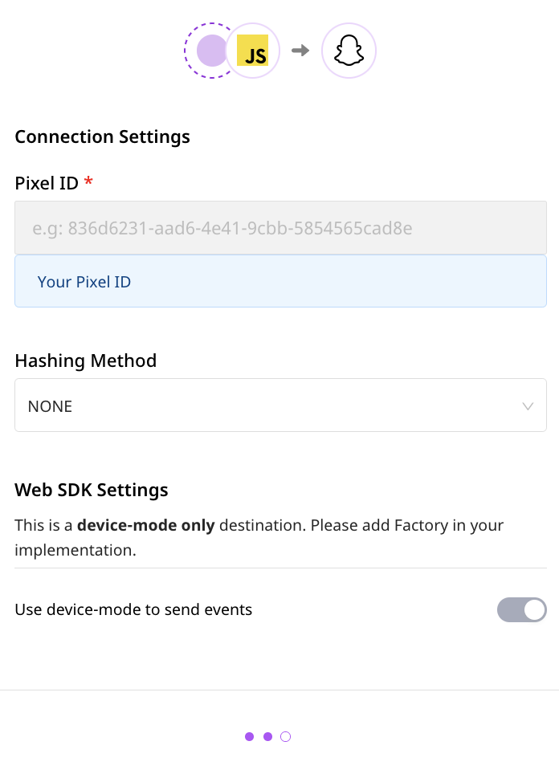

# Snap Pixel

The [**Snap Pixel**](https://ads.snapchat.com/) is a piece of JavaScript code that helps Advertisers measure the cross-device impact of Campaigns. Advertisers will be able to see how many Snapchatters take action on their website(s) after seeing their Ad.

You can now seamlessly send your event data to Snap Pixel by adding it as a destination in RudderStack.

## Getting Started

Before configuring Snap Pixel as a destination in RudderStack, verify if the source platform is supported by Snap Pixel by referring to the table below: ̦

| **Connection Mode** | **Web**       | **Mobile** | **Server** |
| :------------------ | :------------ | :--------- | :--------- |
| **Device mode**     | **Supported** | -          | -          |
| **Cloud mode**      | -             | -          | -          |


To know more about the difference between Cloud mode and Device mode in RudderStack, refer to the [**RudderStack connection modes**](https://docs.rudderstack.com/get-started/rudderstack-connection-modes) guide.


Once you have confirmed that the source supports sending events to Snap Pixel, perform the steps below:

* From your [**RudderStack dashboard**](https://app.rudderstack.com/), add the source. From the list of destinations, select **Snap Pixel**.


Follow our guide on [**How to Add a Source and Destination in RudderStack**](https://docs.rudderstack.com/how-to-guides/adding-source-and-destination-rudderstack) for more information.


* Give a name to the destination and click on **Next**. You should then see the following screen:



### Configuration Settings

To successfully configure Snap Pixel as a destination, you will need to configure the following settings:

* **Snap Pixel ID:** Enter your Snap Pixel ID here.

* **Hashing Method:** Snap Pixel lets you pass a user parameter (email or phone number) in both hashed and non-hashed formats in it's init call. If **SHA-256** is chosen as an option, RudderStack will hash-encode the provided user parameter (email or the phone number).

* **Custom Events:** Enter your Snap Pixel Custom Events here. Snap Pixel allows to track upto 5 Custom Events.

## Identify


The Snap Pixel will not be initialize unless identify call is fired.


In Snap Pixel, the `identify` call initializes the Snap Pixel snippit code.

For more information on the `identify` call, check out the [**RudderStack API spec**](https://docs.rudderstack.com/rudderstack-api/rudderstack-spec/identify).

A sample `identify` call is as shown:

```javascript
      rudderanalytics.identify({
          email: "sample@sample.com",
          phone: "8787857564"
      });
```

Either or both of the following user parameters should be passed in identify:

| **RudderStack User Parameter**  | **Snap Pixel User Parameter** |
| :-------------------------- | :---------------------------- |
| `email` | `user_email` |
| `phone` | `user_phone_number` |

## Page

When the `page` call is made, the `track` event is sent as `PAGE_VIEW` . RudderStack ignores any parameter sent to `rudderanalytics.page()` .

For more information on the `page` call, check out the [**RudderStack API spec**](https://docs.rudderstack.com/rudderstack-api/rudderstack-spec/page).

A sample `page` call is as shown:

```javascript
rudderanalytics.page();
```

## Track

The `track` call lets you track custom events in your website.

A sample call looks like the following code snippet:

```javascript
rudderanalytics.track('PURCHASE', {
    'currency': 'USD',
    'price': 333.33,
    'transaction_id': '11111111'
});
```


Any Snap Pixel Standard Events apart from shown below will be passed as it is and user can provide upto 5 Custom events (should match that of the dashboard) of their own along with the event payload wherever as needed.


RudderStack transforms the following events to Snap Pixel's Standard Events:

| **RudderStack Event Name**  | **Snap Pixel Standard Event** |
| :-------------------------- | :---------------------------- |
| `Order Completed` | `PURCHASE` |
| `Checkout Started` | `START_CHECKOUT` |
| `Product Added` | `ADD_CART` |
| `Payment Info Entered` | `ADD_BILLING` |
| `Promotion Clicked` | `AD_CLICK` |
| `Promotion Viewed` | `AD_VIEW` |
| `Product Added To Wishlist` | `ADD_TO_WISHLIST` |

## Contact Us

If you come across any issues while configuring or using Snap Pixel with RudderStack, feel free to [**contact us**](mailto:%20docs@rudderstack.com) or start a conversation on our [**Slack**](https://resources.rudderstack.com/join-rudderstack-slack) channel.
