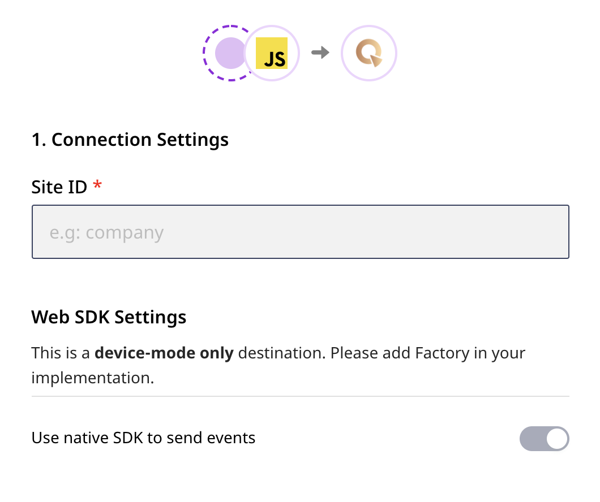

# Quantum Metric

[**Quantum Metric**](https://www.quantummetric.com/) is a continuos product design platform that lets you leverage real-time digital insights to improve your product. It gives you complete visibility into your customers' product experience and helps you prioritize the most important product features that have the most impact on your brand.

RudderStack helps you integrate your website with Quantum Metric to auto-track all your user data.

## Getting started

Before configuring Quantum Metric as a destination in RudderStack, make sure that the source platform is supported by Quantum Metric by referring to the following table:

| **Connection Mode** | **Web**       | **Mobile** | **Server** |
| :------------------ | :------------ | :--------- | :--------- |
| **Device mode**     | **Supported** | -          | -          |
| **Cloud mode**      | -             | -          | -          |


To know more about the difference between cloud mode and device mode in RudderStack, read the [**RudderStack connection modes**](https://docs.rudderstack.com/get-started/rudderstack-connection-modes) guide.


Once you have confirmed that Quantum Metric supports the source type, follow these steps:

* From your [**RudderStack dashboard**](https://app.rudderlabs.com/), add the source. Then, select **Quantum Metric** from the list of destinations.


Follow our [**Adding a Source and Destination**](https://docs.rudderstack.com/getting-started/adding-source-and-destination-rudderstack) guide for more information.


* Assign a name to your destination, and then click on **Next**. You should then see the following screen:



### Connection Settings

The following settings need to be configured to successfully set up Quantum Metric as a destination in RudderStack:

* **Site ID**: Enter your site ID here.


Your can get the Site ID by logging into your [**IAM Quantum Metric dashboard**](https://iam.quantummetric.com/). There, select the **Account** button in the top-right corner. Then, click on **Install** and inspect the installation tag. Your site ID will be found in the following line:

```
qtm.src = 'https://cdn.quantummetric.com/qscripts/quantum-<SITE_ID>.js';
```


* Finally, click on **Next** to complete the configuration. Quantum Metric will now be added and enabled as a device-mode destination in RudderStack.


As this is a web device mode-only integration, the **Use native SDK to send events** option cannot be disabled. For more information on the web device mode, refer to the [**RudderStack connection modes**](https://docs.rudderstack.com/get-started/rudderstack-connection-modes) guide.


## Sending events to Quantum Metric

Quantum Metric auto-tracks your user data. So, there is **no need** to call any of `identify`, `page` or `track` methods explicitly. 

## Contact us

If you come across any issues while configuring or using Quantum Metric with RudderStack, feel free to [**contact us**](mailto:%20docs@rudderstack.com) or start a conversation on our [**Slack**](https://rudderstack.com/join-rudderstack-slack-community) channel.
