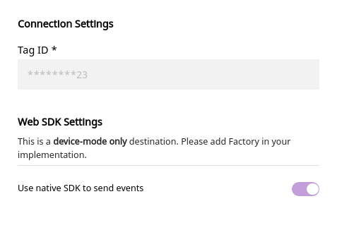

# Bing Ads

[Bing Ads](https://ads.microsoft.com/) is a pay per click (PPC) advertising platform that works on both Bing and Yahoo search engines. It allows marketers to track and monitor their ad campaigns, resulting clicks, CTRs, and more. With Bing Ads, you can also implement efficient ad retargeting for your customers who have completed actions like adding product to a cart or view a product without purchasing it.

RudderStack supports Bing Ads as a destination to which you can send your real-time event data seamlessly.


## Getting Started

To enable sending data to Bing Ads, you will first need to add it as a destination to the source from which you are sending the event data. Once the destination is enabled, events from our JavaScript SDK will start flowing to Bing Ads.

Before configuring your source and destination on the RudderStack, please check whether the platform you are sending the events from is supported by Bing Ads. Please refer the following table to do so:

| **Connection Mode** | **Web** | **Mobile** | **Server** |
| :--- | :--- | :--- | :--- |
| **Device mode** | **Supported** | - | - |
| **Cloud mode** | - | - | - |


To know more about the difference between Cloud mode and Device mode in RudderStack, read the [RudderStack connection modes](https://docs.rudderstack.com/get-started/rudderstack-connection-modes) guide.


Once you have confirmed that the platform supports sending events to Bing Ads, perform the steps below:

* From your [RudderStack dashboard](https://app.rudderstack.com/), add the source and Bing Ads as a destination.


Please follow our guide on [How to Add a Source and Destination in RudderStack](https://docs.rudderstack.com/how-to-guides/adding-source-and-destination-rudderstack) to add a source and destination in RudderStack.


* Give a name to the destination and click on **Next**. You should then see the following screen:



* Please enter the **Tag ID** of your Bing Ads account.
* Click on **Save** to finish the configuration. Bing Ads will now be added and enabled as a destination in RudderStack.

## Page

You can make a `page` call to Bing Ads to record a page view. The SDK will send this data to Bing Ads with event type `pageLoad`.

A sample `page` call is as shown:

```javascript
rudderanalytics.page();
```

## Track

The `track` call allows you to capture any action that the user might perform, and the properties associated with that action. Each action is considered to be an event.

RudderStack maps the `properties.category` and `properties.currency` fields to the corresponding category and currency fields of Bing Ads, respectively. RudderStack also maps `properties.total` and `properties.revenue` or `properties.value` to the variable `revenue`. 

To use this call, only the event name is required - all other properties are optional. 

A sample `track` call looks like the following:

```javascript
rudderanalytics.track("Item Purchased", {
  category: 'MyCategory',
  currency: 'INR',
  total: 5,
  revenue: 125,
  value: 100  
});
```


Priority of properties.total is higher followed by properties.revenue followed by properties.value.


## Configuring the UET tag

Before you can track conversions or target audiences, you need to create a UET tag in Bing Ads and then add it to the **Connection Settings**. Follow the steps mentioned in the [Bing Ads documentation](https://about.ads.microsoft.com/en-us/resources/training/universal-event-tracking) to create a UET tag.

The UET tag can be created after logging into your Bing Ads account and navigating to **Tools** - **Conversion Tracking** - **UET tag** - **Create UET tag**.

## Contact Us

If you come across any issues while configuring Bing Ads with RudderStack, please feel free to [contact us](mailto:docs@rudderstack.com). You can also start a conversation on our [Slack](https://resources.rudderstack.com/join-rudderstack-slack) channel; we will be happy to talk to you!

