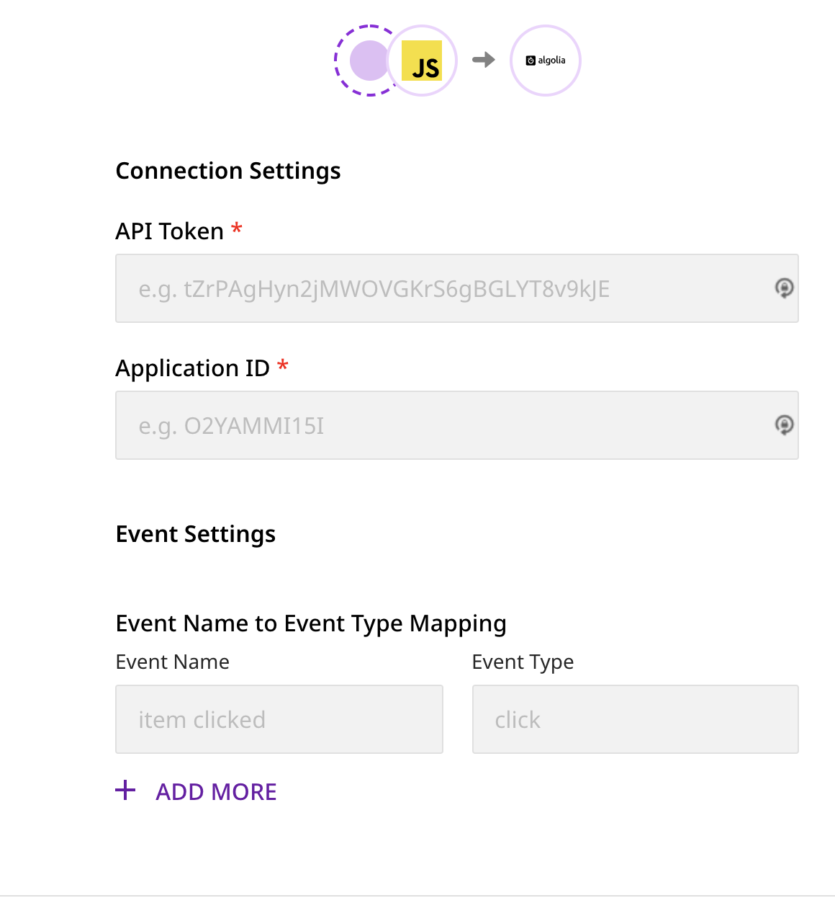

# Algolia

[**Algolia**](https://www.algolia.com/) helps businesses build and optimize the search and discovery experience resulting in significantly enhanced online engagement, increased conversion rates and enriched lifetime value that generates profitable growth.

RudderStack supports Algolia as a destination to which you can seamlessly send your customer data.

## Getting Started

Before configuring Algolia as a destination in RudderStack, verify if the source platform is supported by Algolia by referring to the table below:

| **Connection Mode** | **Web** | **Mobile** | **Server** |
| :--- | :--- | :--- | :--- |
| **Device mode** | - | - | - |
| **Cloud** **mode** | **Supported** | **Supported** | **Supported** |


To know more about the difference between Cloud mode and Device mode in RudderStack, read the [**RudderStack connection modes**](https://docs.rudderstack.com/get-started/rudderstack-connection-modes) guide.


Once you have confirmed that your source platform supports sending events to Algolia, follow these steps:

* From your [**RudderStack dashboard**](https://app.rudderstack.com/), add the source. From the list of destinations, select **Algolia**.


Follow our guide on [**Adding a Source and Destination in RudderStack**](https://docs.rudderstack.com/how-to-guides/adding-source-and-destination-rudderstack) for more information.


* Assign a name to the destination and click on **Next**. You should then see the following screen:



### Connection Settings

This section details the connection settings required to configure Algolia as a destination in RudderStack.

* Enter your Algolia **API Key** and **Application ID**.


To get the Algolia API key and Application ID, go to your [Algolia dashboard](https://www.algolia.com/apps/). Under API keys menu, copy **Application ID** and **Search-Only API Key**.


* Under **Event Settings**, you can add `Event Name` and its corresponding `Event Type`. Its optional and this value can also be passed via track call. 


`Event Name` to `Event Type` mapping in the dashboard will have higher priority.


* Click on **Next**. Algolia will now be enabled as a destination in RudderStack.

## Track

The `track` call lets you send events related to how your product is being used. The required fields are `event`, `eventType`, `index` and either `objectIds` or `filters`.

`event` and `eventType` can be mapped from the dashboard, which will have higher priority. If an `event` has its corresponding `eventType` present in the dashboard, you don't need to send `eventType` in the track call. 

If a new `event` is being sent via call which is not present in the dashboard, in that case `eventType` must be send via call, else call will be **dropped**.

The following table includes all `track` fields with their relative mapping to the Algolia fields

| **RudderStack Field** | **Algolia Field** |
| :--- | :--- |
| `userId` / `anonymousId` | `userToken` |
| `index` | `index` |
| `eventType` | `eventType` |
| `timestamp` | `timestamp` |
| `queryId` | `queryID` |
| `filters` | `filters` |
| `objectIds` | `objectIDs` |
| `positions` | `positions` |

A sample track call is as shown:

```javascript
rudderanalytics.track("event name", {
  eventType: "click",  
  index: "index1",
  timestamp: 1630649198801,
  objectIds: [ "objId1","objId2"],
  positions: [1,2],
  queryId: "e28d338dbfbbdcb4678d9d30a5e286ee"
});
```

A few things to note: 

* `eventType` can only be either `click`, `view` or `conversion`.
* `timestamp` must be in milliseconds Unix epoch and must be maximum 4 days old.
* `queryId` must be `32` character hexadecimal string.
* `filters` must be an array of `strings`. If it has more than `10` strings, only first `10` values will be passed.
* `objectIds` must be an array of `strings`. If it has more than `20` strings, only first `20` values will be passed.
* `positions` must be an array of `integers`. It must be passed for only `click` type events. Only first `20` values will be passed.

Note that for all `eventType` either `filters` or `objectIds` should be passed, but **not** both.
For `click` eventType, if `objectIds` is passed then either `both` `positions` and `queryId` must be passed or `none` of them. Length of `objectIds` and `positions` should be equal.

Rudderstack supports `products` array for two events [`product list viewed`](https://docs.rudderstack.com/rudderstack-api/api-specification/rudderstack-ecommerce-events-specification/browsing#product-list-viewed) and [`order completed`](https://docs.rudderstack.com/rudderstack-api/api-specification/rudderstack-ecommerce-events-specification/ordering#order-completed). It can passed as shown:

```javascript
rudderanalytics.track("product list viewed", {
  index: "index1",
  products: [
    {
      objectId: "objectId",
      position: 1
    }
  ]
});
```
## Contact Us

If you come across any issues while configuring or using Algolia with RudderStack, you can [**contact us**](mailto:%20docs@rudderstack.com) or start a conversation on our [**Slack**](https://resources.rudderstack.com/join-rudderstack-slack) channel.


