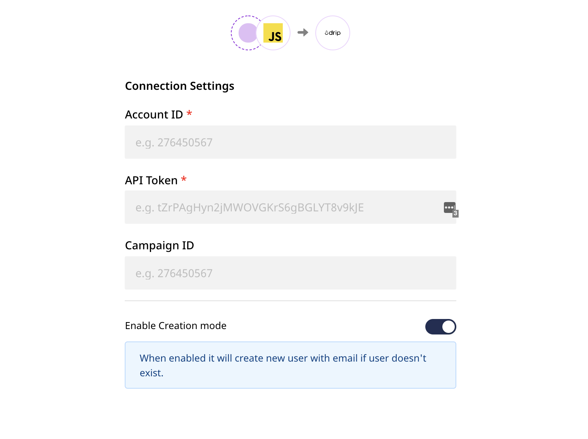

# Setting Up Drip in RudderStack

To enable sending data to Drip, you will first need to add it as a destination in RudderStack. Once the destination is configured and enabled, events from RudderStack will start flowing to Drip.

Before configuring Drip as a destination, verify if the source platform supports sending events to RudderStack, by referring to the table below:

| **Connection Mode** | **Web**       | **Mobile**    | **Server**    |
| :------------------ | :------------ | :------------ | :------------ |
| **Device mode**     | **Supported** | -             | -             |
| **Cloud** **mode**  | **Supported** | **Supported** | **Supported** |


To know more about the difference between Cloud mode and Device mode in RudderStack, read the [**RudderStack connection modes**](https://docs.rudderstack.com/get-started/rudderstack-connection-modes) guide.


Once you have confirmed that the source supports sending events to Drip, follow these steps:

- From your [**RudderStack dashboard**](https://app.rudderstack.com/), add the source. From the list of destinations, select **Drip**.


Follow our guide on [**How to Add a Source and Destination in RudderStack**](https://docs.rudderstack.com/how-to-guides/adding-source-and-destination-rudderstack) for more information.


- Give a name to the destination and click on **Next**. You should then see the following screen:

- Enter your Drip **Account ID**.


To get your **Account ID**. click [here](https://www.getdrip.com/settings/general).


- Enter your **API Token**.


**API token** is required when using cloud mode. To get your Drip API token, click [here](https://www.getdrip.com/user/edit).


- Enter your **Campaign ID**. You can also send your Campaign Id via the `identify` call.


If **Campaign ID** is provided, we will by default try to subscribe users. To get your campaign ID click [here](https://www.getdrip.com/campaigns). Click on your `Email Series`. Last part of the url is the campaign Id. e.g. https://www.getdrip.com/account_id/campaigns/campaign_id.
You can also send `Campaign Id` via call which will have higher precedence.


- **User Creation Mode** allows you to create the user with `email` for track call, if the user doesn't already exist.

- To send events via device mode , enable **Use device-mode to send events** .

- Finally, click on **Next**. Drip will now be enabled as a destination in Rudderstack.

## Contact Us

If you come across any issues while configuring Drip with RudderStack, feel free to [**contact us**](mailto:%20docs@rudderstack.com) or start a conversation on our [**Slack**](https://resources.rudderstack.com/join-rudderstack-slack) channel. we will be happy to talk to you!
