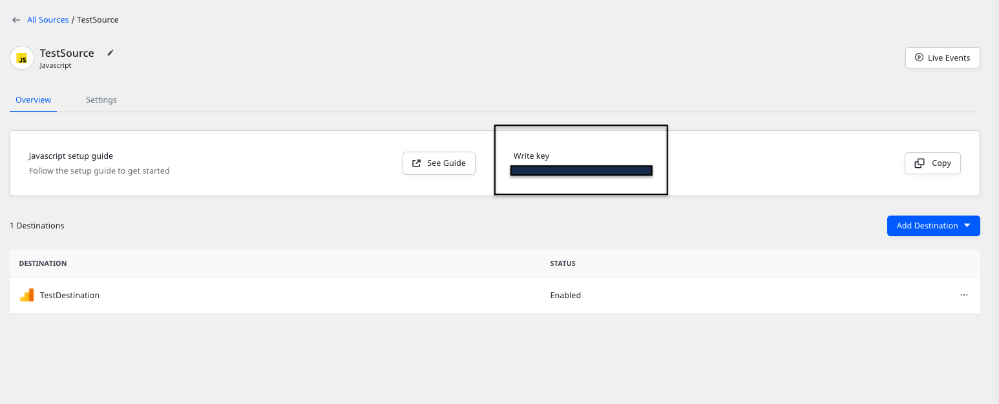
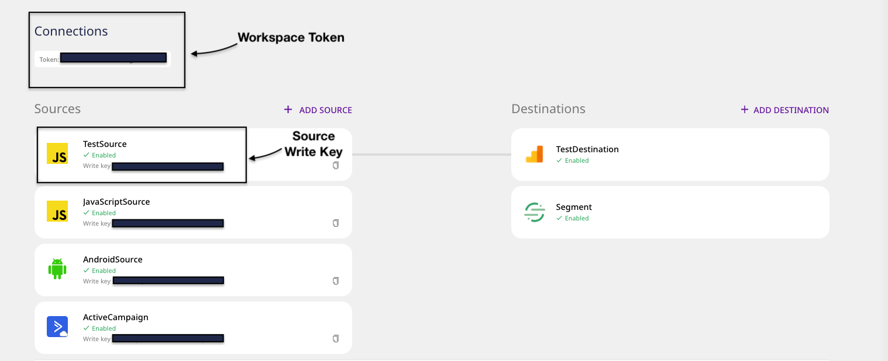

# Install and Set Up RudderStack


The easiest way to get started with RudderStack is to sign up for free on [**RudderStack Cloud** **Free**](https://app.rudderlabs.com/signup?type=freetrial).


## Setup Instructions

* Setup instructions for [**Docker**](docker.md)\*\*\*\*
* Setup instructions for [**Kubernetes**](kubernetes.md)\*\*\*\*
* Setup instructions for a [**Native Installation**](native-installation.md)\*\*\*\*
* Setup instructions for a [**Developer Machine Setup**](developer-machine-setup.md)\*\*\*\*


If you are planning to use RudderStack in production, we strongly recommend using the [**Kubernetes**](kubernetes.md) Helm charts. We update our Docker images with bug fixes much more frequently than our [**GitHub repository**](https://github.com/rudderlabs/rudder-server).



You can [**contact us**](https://resources.rudderstack.com/join-rudderstack-slack) for help if you're stuck at any stage of the setup process.


## Sending Test Events to Verify the Installation


This section assumes you have already [**installed and set up RudderStack**](./).


Before sending test events to verify your RudderStack installation, clone the RudderStack [**GitHub repository**](https://github.com/rudderlabs/rudder-server) by running the following command:

```bash
git clone https://github.com/rudderlabs/rudder-server.git
```

Then, follow the sections below to send events to test your RudderStack installation.

### Getting the Source Write Key

If you have signed up for [**RudderStack Cloud**](https://app.rudderstack.com/), follow these steps to get your source write key:

* Set up a source and a destination in RudderStack by following this [**guide**](../../connections/adding-source-and-destination-rudderstack.md). 
* You can find the write key in the dashboard, as shown:




The **write key** is different from your **workspace token**. The write key is associated with the source, while the workspace token is associated with your RudderStack workspace.




If you are self-hosting RudderStack and have set up the control plane using the [**RudderStack Config Generator**](../config-generator.md), you can find the write key associated with your source by following these steps:

* Set up a source and a destination by following this [**guide**](../../connections/adding-source-and-destination-rudderstack.md). 
* You can find the write key associated with the source in the dashboard as shown:


### Sending Test Events

In our [**GitHub repository**](https://github.com/rudderlabs/rudder-server) ****\(which you cloned above\) we have bundled a shell script that generates test events.

#### If you're using RudderStack Cloud, follow these steps:

* In your terminal, navigate to the folder where RudderStack is installed. 
* Then, run the following command after replacing `<YOUR_WRITE_KEY>` with the source write key obtained in the previous section:

```bash
./scripts/generate-event <YOUR_WRITE_KEY> https://hosted.rudderlabs.com/v1/batch
```

* You can then check your destination to verify that events are delivered. You can also view the live events via RudderStack's [**Live Events**](../../user-guides/how-to-guides/live-destination-event-debugger.md) ****tab.

#### If you have set up open-source RudderStack in your environment, follow these steps:

* In your terminal, navigate to the folder where RudderStack is installed. 
* Then, run the following command after replacing `<YOUR_WRITE_KEY>` with the source write key obtained in the previous section, and `<DATA_PLANE_URL>` with your Data Plane URL.

```bash
./scripts/generate-event <YOUR_WRITE_KEY> <DATA_PLANE_URL>/v1/batch
```

An example is as shown:


* You can then check your destination to verify that the events are delivered.


Note that unlike RudderStack Cloud, the Control Plane set up using the open-source [**Config Generator**](../config-generator.md) does not let you view live events.


If you supply an invalid source write key or Data Plane URL, you will get the following error:


## FAQs

### What is a Data Plane URL? Where do I get it?


Refer to the [**RudderStack Architecture**](../rudderstack-architecture.md) guide for more information the RudderStack Data Plane.


For routing and processing the events to the RudderStack backend, a **Data Plane URL** is required. 

Here's how to get the Data Plane URL:

* If you're using the **open-source** version of RudderStack, you are required to set up your own Data Plane by [**installing and setting up RudderStack**](./) in your preferred environment. 


An open-source Data Plane URL looks like `http:localhost:8080` where `8080` is typically the port where your RudderStack Data Plane is hosted.  


* If you're using the [**pro or enterprise**](https://rudderstack.com/pricing) version of RudderStack, please contact us for the Data Plane URL with the email ID you used to sign up for RudderStack.

### How to Check the Data Plane Status?

To check your Data Plane status, run the following command:

```bash
CURL <DATA_PLANE_URL>/health
```

A sample command to check the Data Plane status is as shown:

```bash
CURL https://hosted.rudderlabs.com/health
```

You will get the following output:

```text
{"server":"UP", "db":"UP","acceptingEvents":"TRUE","routingEvents":"TRUE","mode":"NORMAL","goroutines":"15364", "backendConfigMode": "API", "lastSync":"2020-12-01T04:20:33Z", "lastRegulationSync":"2020-11-30T21:40:27Z"}
```

The RudderStack server supports two running modes:

* **Normal** \(`"mode": "NORMAL"`\): In this mode, the RudderStack server runs as expected, and there are no issues. 
* **Degraded** \(`"mode": "DEGRADED"`\): RudderStack enters the degraded mode if it keeps crashing while processing the events after a threshold number of restarts is reached. RudderStack still receives and stores the events in this mode but does not process them and route them to your specified destinations.


For more information on the RudderStack Server running modes, refer to our [**High Availability**](../../user-guides/administrators-guide/high-availability.md) guide.


### Why Do I Need a RudderStack Account?

Using the [**RudderStack web app**](https://app.rudderstack.com/) is the easiest way to set up and manage your event data sources, destinations and transformations.


The web app is only used for source/destination configuration and does not have access to your data.   
  
The [**Live Events**](../live-events.md) console can be used to temporarily stream events for debugging purposes, but only for a limited time. **RudderStack does not persist any of your data**.


If you do not wish to sign up for RudderStack and want to self-host the Control Plane, you can do so using the open-source [**RudderStack Config Generator**](../../user-guides/how-to-guides/rudderstack-config-generator.md). 


Note that the Control Plane set up using the Config Generator does not have features like [**Transformations**](../../adding-a-new-user-transformation-in-rudderstack/) and [**Live Events**](../live-events.md).


## Contact Us

For any questions on installing and setting up RudderStack, feel free to [**contact us**](mailto:%20docs@rudderstack.com). You can also start a conversation on our [**Slack**](https://resources.rudderstack.com/join-rudderstack-slack) channel.

