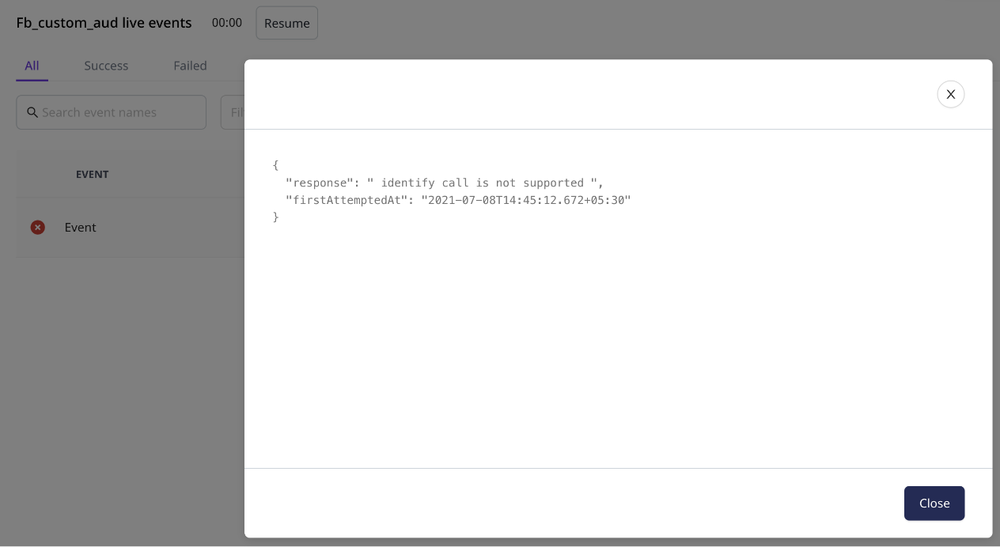

# Live Events

RudderStack's **Live Events** is a debugger that shows a stream of live events collected from your sources and sent to the connected destinations in real-time.

With this feature, you can easily debug any errors in the failing events at a destination level and reduce your troubleshooting time and efforts.


To use this feature, make sure you have configured your source and destination in RudderStack. For more information on adding a source and destination in RudderStack, follow this [**guide**](../connections/adding-source-and-destination-rudderstack.md).


## **How to View the Live Events** 

This section includes the steps to view the live events for your sources and destinations.‌

### Sources 

To view the live events collected from your source in real-time, follow these steps:‌

* Make sure you have configured a source and destination in RudderStack. Follow this [**guide**](https://app.gitbook.com/@rudderlabs/s/rudderlabs-1/\~/diff/drafts/-MdGKMQEdba4ZbKvF7Mf/connections/adding-source-and-destination-rudderstack) for more information.
*   Select the **Connections** option on your left nav bar and click on the source for which you want to view the live events.

    .png>)
*   Then, click on the **Live Events** button on the top right as shown:

    .png>)
*   Now you can ingest the data into RudderStack through the source and see the collected events in this window.

    .png>)


For details on the information available in the **Live Events** window, check the [**Source Live Events**](https://docs.rudderstack.com/get-started/live-events#source-live-events) section.


### Destinations

To view the live events sent to your destination in real-time, follow these steps:

* Make sure you have configured a source and destination in RudderStack. Follow this [**guide**](../connections/adding-source-and-destination-rudderstack.md) for more information.


Make sure your destination is configured in the **Cloud mode**. Refer to the [**Connection Modes**](../connections/rudderstack-connection-modes.md) guide for more information on the Cloud mode.


*   Select the **Connections** option on your left nav bar and click on the destination for which you want to view the live events.

    .png>)
*   Then, click on the **Live Events** button on the top right as shown:

     (1) (1).png>)
*   You should be able to see the events sent to the destination in this window.

    .png>)


For details on the information available in the **Live Events** window, check the [**Destination Live Events**](https://docs.rudderstack.com/get-started/live-events#destination-live-events) section.


## **Source Live Events**

The **Live Events** feature gives you real-time visibility into the source events collected by RudderStack. The key information includes:

* The **name** of the event.
* The **type** of the event collected from the source.
* **Date** and time of the collected event.


This feature is very handy in case you want to check if your source is correctly configured. For example, you can check if your JavaScript SDK loads correctly on your website.


## **Destination Live Events**

When routing events to a destination, it can be frustrating if the events sent do not show up in the destination and not knowing the reason for failure only makes it worse.

The **Live Events** feature gives you real-time visibility into the destination's responses. The key information captured includes:

* **Event Name:** Corresponding to the name of the event.
* **Error Code**: In case the event fails, this gives specific details related to the error. These details include the error response and the date and time of the attempt to send the event.

The payload sent to the destination can be seen by clicking on an event. This is shown in the right-hand side window on the same page, as shown:

### Use-case

Suppose you are trying to send some events to Facebook Custom Audience but they are not being delivered. Upon checking the **Live Events** tab for the Custom Audience destination, you see the following error in the UI:

.png>)

You can click on the **See full error** option to see the error response, as shown:

As seen above, you were trying to send an `identify` event to Facebook Custom Audience, which the destination does not support. You can refer to the [**Custom Audience documentation**](../destinations/advertising/fb_custom_audience.md) to confirm that only `track` events are supported. As a result, when RudderStack tries sending the `identify` event to the destination, an error is thrown. RudderStack tries sending this event several times before marking it as aborted.


The responses received from the destination help you in quickly identifying and resolving the issues.



Live events are shown for all the destinations. However, the **payload of the events** is not shown for some destinations like the [**object storage platforms**](../destinations/storage-platforms/) and the [**data warehouses**](../data-warehouse-integrations/) supported by RudderStack.


## **Transformation Live Events**

RudderStack also gives you the option of viewing the events before and after a transformation is applied.

.png>)

RudderStack also notifies you about any dropped events or any errors during the transformation along with the details, as shown in the following image:

.png>)

Note that this feature is applicable for cases where you have connect a [**transformation**](../transformations/) to a destination, as shown:

.png>)

## **FAQs**

### **Why are my events failing?**

Routing events to a destination can fail for various reasons. Often, it is because the destination is configured incorrectly. Some other reasons could be incorrect/bad event payload structure, rate-limiting by the destination, etc. In some rare cases, the destination could be down too.

## **Contact Us**

To know more about the Live Events feature, you can [**contact us**](mailto:%20docs@rudderstack.com) or start a conversation on our** **[**Slack**](https://rudderstack.com/join-rudderstack-slack-community/) channel.
