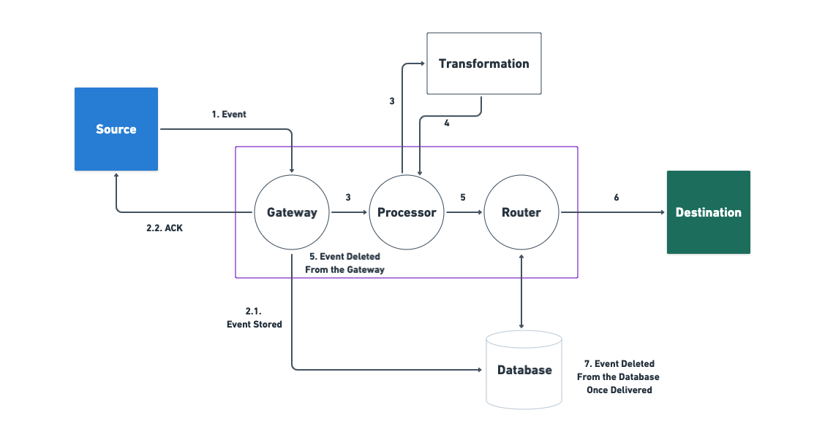

# Architecture

RudderStack is an independent, stand-alone system with dependency only on the database \(**PostgreSQL**\). Its backend is written in Go, with a rich UI written in React.js.


**Start building a better, warehouse-first CDP that delivers complete, unified data to every part of your marketing and analytics stack.** [**Sign up**](https://app.rudderlabs.com/signup?type=freetrial) **for** [**RudderStack Cloud Free**](https://app.rudderlabs.com/signup?type=freetrial) **today.**


A high-level view of RudderStack’s architecture is as shown:

RudderStack's architecture consists of 2 major components, namely the **Control Plane** and **Data Plane**.

## **Control Plane**

The Control Plane offers an intuitive UI to configure your event data sources and destinations. It comprises of:

* **RudderStack Web App**: This is the [**front-end application**](https://app.rudderlabs.com/signup?type=freetrial) that lets you set up your data pipelines in RudderStack.
* **Configuration Backend**: The configuration backend gives you the options to configure your event data sources, destinations, and connections.

## **Data Plane**

The Data Plane is RudderStack's core engine responsible for:

* Receiving and buffering the event data
* Transforming the events in the required destination format
* Relaying the events to the destination


The RudderStack Data Plane uses PostgreSQL as a streaming database for the event data. Refer to the **Data Plane Architecture** section below for more information.


## **Transformation**

RudderStack's Transformations module transforms the received event data into a suitable destination-specific format. All the transformation codes are written in JavaScript.

RudderStack also supports user-specific transformations for real-time operations, such as aggregation, filtering, and sampling.


Refer to the [**RudderStack Transformations**](../transformations/) guide for more information on this feature.


## **Data Plane Architecture**

RudderStack's Data Plane is responsible for receiving, transforming, and routing the event data to the destination. To do so, it receives the event data from sources that include websites, mobile apps, server-side applications, cloud apps, and data warehouses.

A simplified version of the RudderStack Data Plane architecture is as shown:

The following sections give a detailed overview of each of the components of the RudderStack Data Plane**:**

### **Gateway**

The Gateway is primarily responsible for receiving and forwarding the event data for processing and transformation.

It accepts the event requests and sends an acknowledgement back to the source depending on the acceptance \(an HTTP 200 response\) or rejection of the event data.

The event data is rejected in case of the following scenarios:

* Invalid JSON
* Invalid write key
* Improper request size

The source event can come from a web, mobile, or server-side app. In case of successful receipt, the events are then forwarded for transformation.

The Gateway also temporarily stores all the received event data into PostgreSQL before sending the acknowledgment of a successful receipt. Once the event is sent to the destination, the Processor deletes the data stored in the database.

### **Processor**

The Processor fetches the data from the Gateway and forwards it to the Transformation module. Once the event data is transformed, the Processor forwards it to the Router module that sends it to the required destination.

### **Router**

The Router sends the processed and transformed event data from the Processor to the desired destinations, including marketing and analytics platforms, CRMs, data warehouses, etc.

### **Transformation Module**

The Transformation module takes the event data from the Processor and converts the event data into the required destination format. It then sends this transformed data back to the Processor. The Processor then forwards the data to the Router, which then routes it to the desired destination.


RudderStack supports user-defined transformations where event data can be transformed using custom JavaScript functions. Some common use-cases include modifying the events, performing event aggregation, sampling, etc. 

Check out the [**GitHub repository**](https://github.com/rudderlabs/sample-user-transformers) for more information related to these functions.


## **Data Plane Workflow**

The RudderStack backend workflow is detailed in the following steps:

1. The Gateway receives the event from the source. 
2. The Gateway then:

   i.  Stores the event data to the Router database \(PostgreSQL\).

   ii. Sends an **HTTP 200** status acknowledging receipt of the data.

3. The Processor picks the data from the Gateway and forwards the event data to the Transformation module. 
4. The Transformation module transforms the event and sends it back to the Processor.
5. Once the event is transformed and sent to the Router, it is deleted from the Gateway store.
6. The Router then:  

   i.  Forwards the transformed event data to the desired destinations.

   ii. Stores the information in a separate table in the database.

7. Once the transformed data reaches the destination, the event data from the Router database is deleted by the Router.

## **Notes**

The RudderStack backend can be customized with a variety of configuration options. Some of these options include backing up events to S3, rejecting malicious requests by defining the maximum size of the event, and more.

Although the default configuration works just fine for most use-cases, RudderStack gives you the flexibility to customize it by tweaking the [**`config.yaml`**](https://github.com/rudderlabs/rudder-server/blob/master/config/config.yaml) file to suit your application's needs.


Refer to the [**Configuration Parameters**](../user-guides/administrators-guide/config-parameters.md) guide for more information on these configuration options.


## Contact Us

To know more about RudderStack's architecture, feel free to [**contact us**](mailto:%20docs@rudderstack.com) or start a conversation on our [**Slack**](https://resources.rudderstack.com/join-rudderstack-slack) channel. You can also [**request a demo**](https://rudderstack.com/request-a-demo/) to see RudderStack in action.

