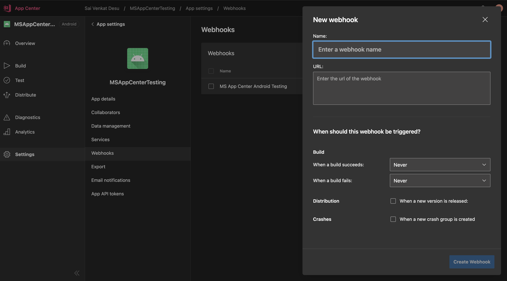
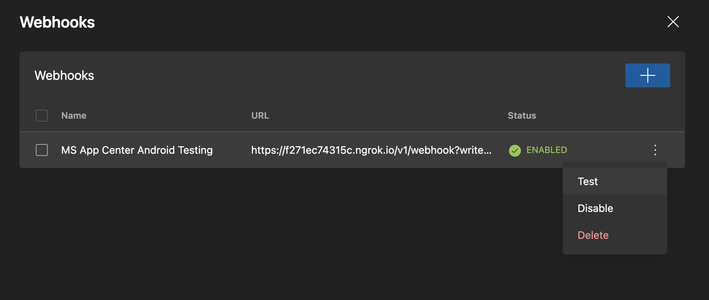

# App Center

[App Center](https://appcenter.ms) is Microsoft's cross-platform build automation and management platform. It allows you to manage your app's lifecycle seamlessly. With App Center, you can automate your builds, test your apps in the cloud effectively and monitor their real-time usage with the help of crash data and analytics.

This document guides you in setting up App Center as a source in RudderStack. 

You can send your App Center events to RudderStack by simply adding a webhook pointing to RudderStack. These events include build success or failure, release of new version of an app, or an app crash. You can also configure what events to send as per your requirement on their dashboard.

## Getting Started

In order to add App Center as a source in RudderStack, please follow these steps:

* From your [RudderStack dashboard](https://app.rudderstack.com), click on **Add Source**. From the list of sources, select **App Center**, as shown:


* Enter the name of your source, and click on **Next**.


* Head over to your App Center account and select the `app` you wanted to configure. Then, navigate to the **Webhooks** section under **Settings** from the sidebar and then create a new Webhook in the view as shown below:



* In the **URL** text box, add a URL pointing to RudderStack in the following format:\
  \
  `<DATA_PLANE_URL>/v1/webhook?writeKey=<YOUR_APP CENTER_SOURCE_WRITE_KEY>`

An example URL should like the following:

```http
https://hosted.rudderlabs.com/v1/webhook?writeKey=1bCenS7ynqHh8ETX8s5Crjh22J
```


Make sure you add the `writeKey` as query parameter to the URL. This is required to prevent the webhook from failing for the lack of a valid write key.



You can validate the endpoint using the **Send Test** button.




* Finally, save the endpoint.

## RudderStack Event Transformation

The events from App Center are ingested into RudderStack after converting it into the RudderStack event format. For example, the `app_name` set by App Center is set as `context.app.name`.

The events sent by App Center are converted into a Rudderstack `track` call with a designated name and properties as the entire event received from App Center. 

Refer to the table below to understand how various events from App Center are converted into Rudderstack `track` calls:

| App Center Event              | RudderStack Track Event Name |
| ----------------------------- | ---------------------------- |
| `On Success of a Build`       | `Build Succeeded`            |
| `On Failure of a Build`       | `Build Failed`               |
| `On Release of a new version` | `Released Version <X.YY>`    |
| `On an App Crash`             | `App Crashed`                |

Also, RudderStack populates the following properties from App Center event payload to the RudderStack event:

| App Center Property            | RudderStack Property                     |
| ------------------------------ | ---------------------------------------- |
| `app_name`, `app_display_name` | `context.app.name`                       |
| `build_id`                     | `context.app.build`                      |
| `os`, `platform`               | `context.device.type`, `context.os.name` |
| `start_time`                   | `originalTimeStamp`                      |
| `sent_at`                      | `sentAt`                                 |
| `short_version`, `app_version` | `context.app.version`                    |
| `bundle_identifier`            | `context.app.namespace`                  |

## Contact Us

If you come across any issues while configuring App Center as a source with RudderStack, please feel free to [contact us](mailto:%20docs@rudderstack.com). You can also start a conversation on our [Slack](https://resources.rudderstack.com/join-rudderstack-slack) channel - we will be happy to talk to you!
