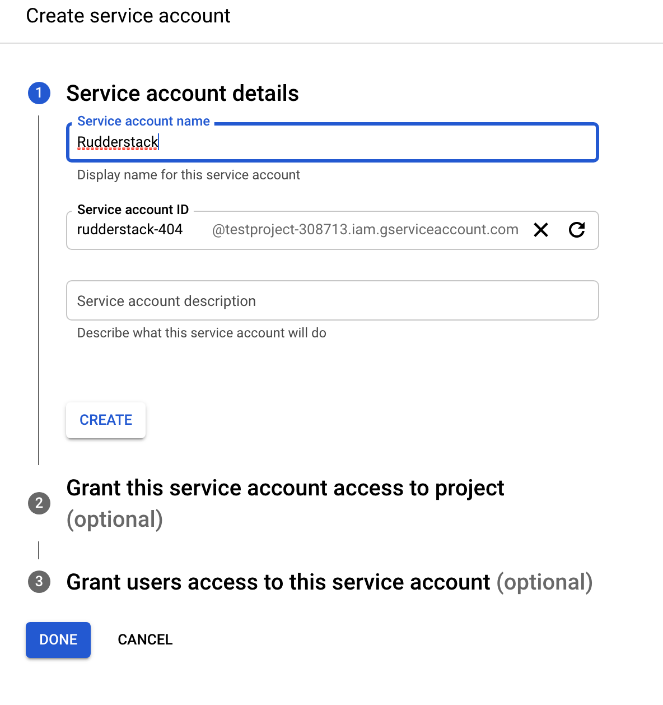
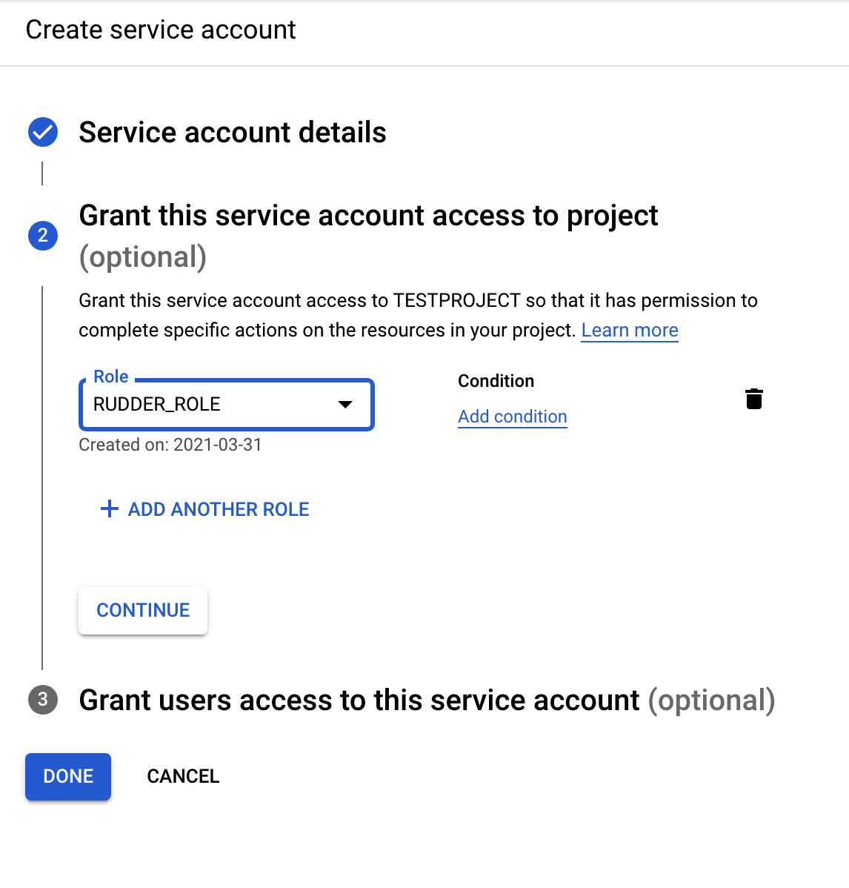

# Google BigQuery

[Google BigQuery](https://cloud.google.com/bigquery) is an industry-leading, fully-managed cloud data warehouse that allows you to store and analyze petabytes of data in no time.

This guide will help you configure BigQuery as a source from which you can route event data to your desired destinations through RudderStack.

## Granting Permissions

Follow these steps below to grant the necessary permissions for Warehouse Actions. For BigQuery, use the **BigQuery Console**.

### Creating the role and adding required permissions

* Go to [**https://console.cloud.google.com/iam-admin/roles**](https://console.cloud.google.com/iam-admin/roles) and click on **CREATE ROLE**.

* Then, fill in the details as shown: 


* Next, click on **ADD PERMISSIONS** and add the permissions as listed in the following image:


The permissions are as shown below:

```
bigquery.datasets.get
bigquery.jobs.create
bigquery.jobs.list
bigquery.tables.create
bigquery.tables.get
bigquery.tables.getData
bigquery.tables.list
bigquery.tables.update
bigquery.tables.updateData
```

* After adding all the required permissions, click on **CREATE**.

### Creating the service account & attaching the role to it

* Next, go to [**https://console.cloud.google.com/iam-admin/serviceaccounts**](https://console.cloud.google.com/iam-admin/serviceaccounts).

* Select the project which has the dataset or the table that you want to use.

* Click on **CREATE SERVICE ACCOUNT**.

* Fill in the details in Step **1** as shown below, and click **CREATE AND CONTINUE**:



* Then, fill in the details in Step **2** as shown below, and click **CONTINUE**:



* After completing steps **1** and **2**, click on **DONE**. This will move you to the list of service accounts.

### Creating and downloading the JSON key

* Now, click on the three dots under **Actions** in the service account that you just created and select **Manage keys**, as shown:


* Click on **ADD KEY**, followed by **Create new key**, as shown:


* In the resulting pop-up, select **JSON** and click on **CREATE**.


 
* Finally, download this JSON file. This file is required while creating a BigQuery warehouse source in RudderStack - the next section covers the steps to do this.

### Creating the RudderStack schema and granting permissions

* The following command creates a dedicated schema `rudderstack_` used by RudderStack for storing the state of each data sync.

```
create schema rudderstack_;
```

* The following query allows the service account `Rudderstack` to have full access to the schema `rudderstack_` (used by RudderStack).

```
GRANT `roles/bigquery.dataOwner`
     ON SCHEMA rudderstack_
     TO "serviceAccount:rudderstack-404@testproject-308713.iam.gserviceaccount.com";
```

## Setting up the Source

To set up Google BigQuery as a source in RudderStack, follow these steps:

* Log into your [RudderStack dashboard](https://app.rudderlabs.com/signup?type=freetrial).
* From the left panel, select **Sources**. Then, click on **Add Source**, as shown:


* Scroll down to the **Warehouse Sources** and select **BigQuery**. Then, click on **Next**.


### Setting Up the Connection

* Assign a name to your source, and click on **Create Credentials from Scratch**. Then, click on **Next**.



If you've already configured BigQuery as a source before, the existing credentials will automatically appear in the above window.


* Next, enter the **GCP project ID** and the **Credentials** JSON which RudderStack will use to import the data from your BigQuery instance.


### Specifying the Data to Import

* Next, select the **Schema** and the **Table** from which you want RudderStack to import the data.



Your table must include one of the following columns - `email`, `user_id`, or `anonymous_id`.


* Once you specify the table containing the required columns, you will be able to preview a snippet of your data, as shown below:


* Here, you can select all or only a few specific columns of your choice, search the columns by a keyword, and also edit the **JSON Trait Key**, as shown below. You can also preview the resultant JSON on the right. Once you've select the required table columns to import the data from, click on **Next**.


### Setting the Data Update Schedule

* Next, you will be required to set the **Run Frequency** to schedule the data import from your PostgreSQL database to RudderStack. You can also specify the time when you want this synchronization to start, by choosing the time under the **Sync Starting At** option. Then, click on **Next**.


That's it! BigQuery is now successfully configured as a source on your RudderStack dashboard. 

RudderStack will start importing data from your BigQuery instance as per the specified frequency. You can further connect this source to your preferred destinations by clicking on **Connect Destinations** or **Add Destinations**, as shown:



If you have already configured a destination on the RudderStack platform, choose the **Connect Destinations** option. To add a new destination from scratch, you can select the **Add Destination** option.


## Contact Us

If you come across any issues while configuring Google BigQuery as a source on the RudderStack dashboard, please feel free to [contact us](mailto:%20docs@rudderstack.com). You can also start a conversation on our [Slack](https://resources.rudderstack.com/join-rudderstack-slack) channel; we will be happy to talk to you!

